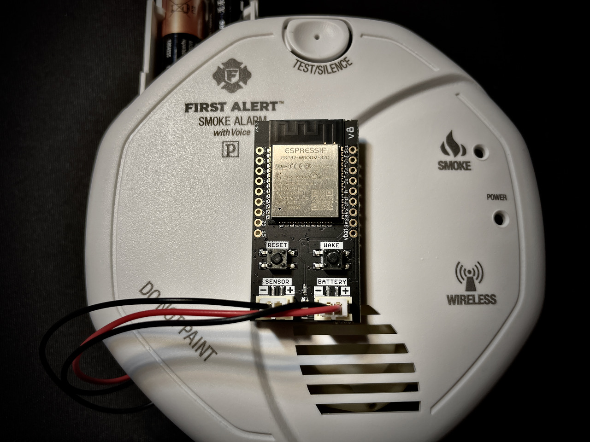
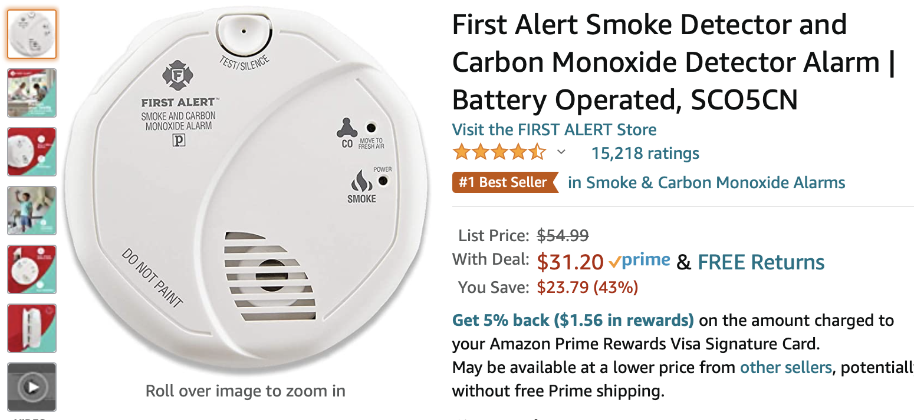
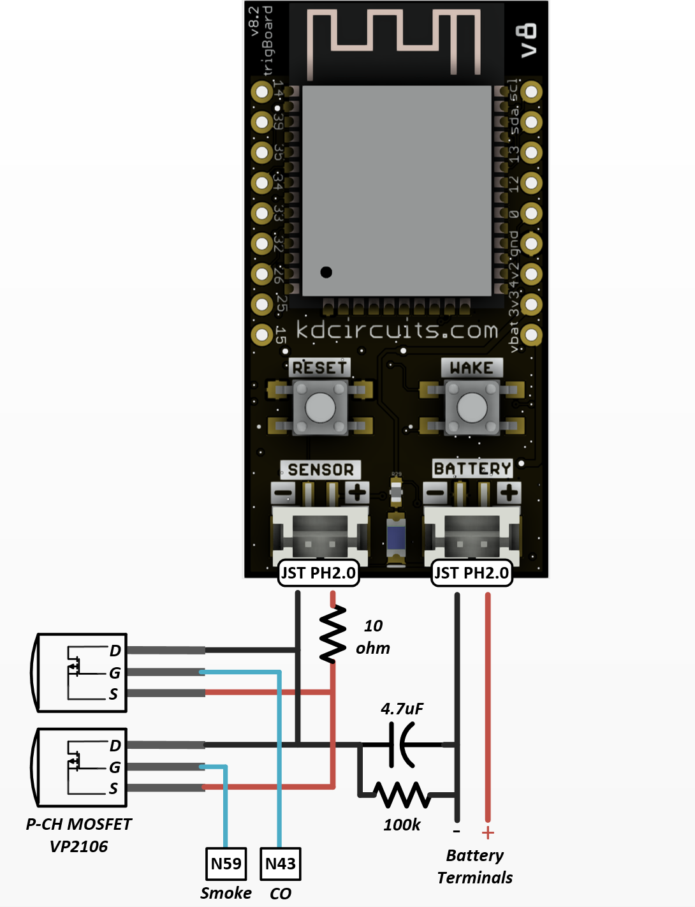
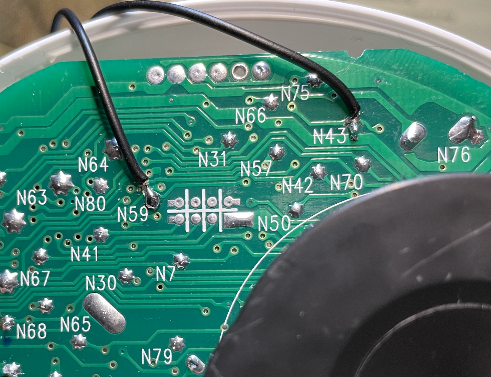
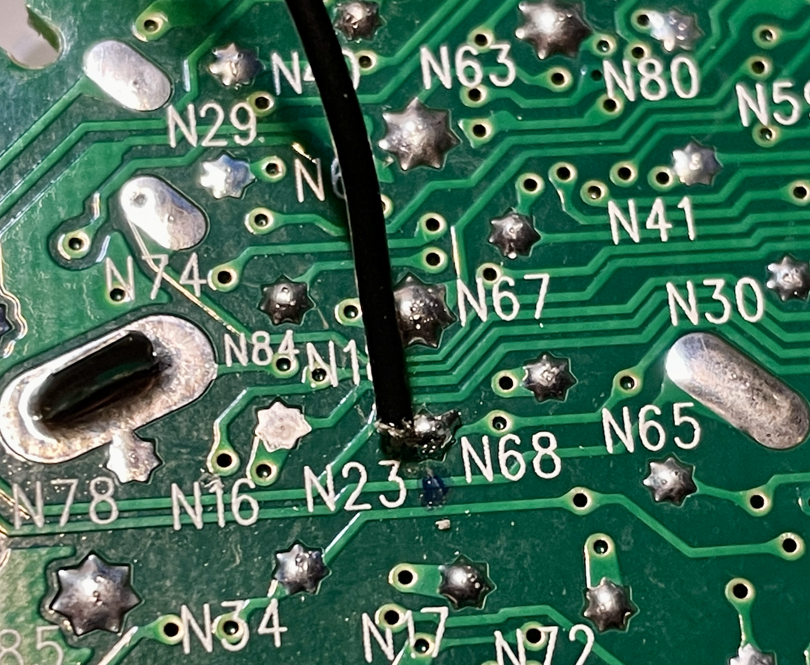

.. _googleDocs:

=============================
Smoke/CO Detector
=============================

**Add trigBoard to an existing Smoke/CO Detector!**  This is something perfect for true peace of mind and originally was only interested in smoke detection, but Carbon Monoxide is an added bonus here.  The reason is because this specific detector runs on two AA batteries which is perfect because that means we can also power the trigBoard.  I was able to find a test point on the board that goes HIGH to 3.3V when the alarm is ON, so that is what is used to go to the sensor input of the trigBoard.

.. warning::
	THIS SHOULD NOT BE DONE ON YOUR PRIMARY SMOKE/CO DETECTOR!!!!  You are making modifications to a life saving device, so there is a chance that this will not work at all - DO NOT RELY ON THIS FOR LIFE SAVING NOTIFICATIONS.  This is clearly not an end-product that you can truly rely on.  Should only be used to supplement an existing system.

.. raw:: html

    

    <iframe width="560" height="315" src="https://www.youtube.com/embed/NuwXAvgs4Ho" frameborder="0" allow="accelerometer; autoplay; encrypted-media; gyroscope; picture-in-picture" allowfullscreen></iframe>
    

.. note::
	Still testing the CO detection - will make part 2 and update docs when fully tested!  

**Smoke Detector**

`Found here on Amazon <https://www.amazon.com/gp/product/B000MXJ498/ref=ppx_yo_dt_b_asin_title_o00_s00?ie=UTF8&psc=1>`_

**Teardown**

I just used a guitar pick and slid around the case to break the tabs free... a screw driver would work as well:

.. image:: images/smoketeardown.png
	:align: center

**Power**

Connect up your JST Cable (PH2.0mm) to the battery contacts - CHECK POLARITY!

.. image:: images/smokepower.png
	:align: center

**Smoke & CO Detection** *Recommended*
-----------------------------------------

This is how I am currently using this system.  I found that the two RED LEDs on the board can be used to wake the trigBoard.  Test points N59 (Smoke) and N43 (Carbon Monoxide).  These are active LOW, but that is completely fine and could even be used to determine "what" woke the trigBoard up and send a custom message based on Smoke/CO detection.  *please contact me if this is of interest*
In order to wake on both signals, P-CH MOSFETS need to be wired in parallel to the sensor input.  
VP2106 MOSFET From Digikey `VP2106N3-G-ND <https://www.digikey.com/en/products/detail/VP2106N3-G/VP2106N3-G-ND/4902414?itemSeq=340798425>`_

The 4.7uF capacitor is used help catch the CO detection pulses.  The 100k is a bleeder resistor to reset the system, while the 10ohm is to simply limit the current rush to charge the capacitor.  

.. image:: images/cosmokepchwire.png
	:align: center

Then just like the next section, I just cut a notch in the vents to feed the wires out to the trigBoard.  Also will be easy to clean up those connections to the P-CH FETS - just showing things loose to better understand how things are hooked up.  

**Smoke Detection Only**
--------------------------

This was my first attempt at this, but then found that N23 pulses every 30 minutes or so for some kind of self-diagnostics.  This may be okay, but may also give false wakes on the trigBoard.  

**Sensor Input**

We only need the negative input for this, so I removed the positive wire.  I found that Test Point "N23" goes HIGH at 3.3V when the alarm is ON.  **or maybe N59 as described above** just since this won't pulse regularly 

.. image:: images/smokesensorinput.png
	:align: center

**Finishing Up**

.. image:: images/smokedone.png
	:align: center

Then would be pretty simple to cut a notch in the housing to route the wires out and mount the board right on top!

**Firmware Setup**

The base firmware supports this right out of the box!  Just configure the device from the "Configurator" to wake on Contact Close - then you're all set.  I might set the low battery alarm to be like 2.5V?  That's another nice feature here is to get a low battery notification as well... like sometimes it's hard to figure out which detector is beeping in the house! 
