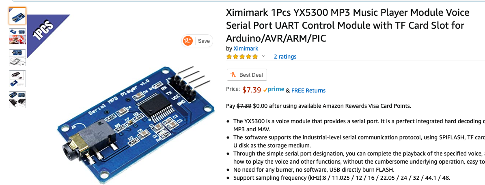
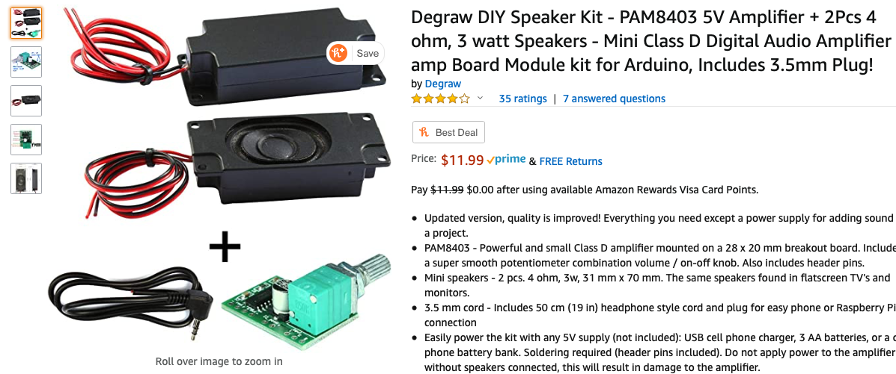
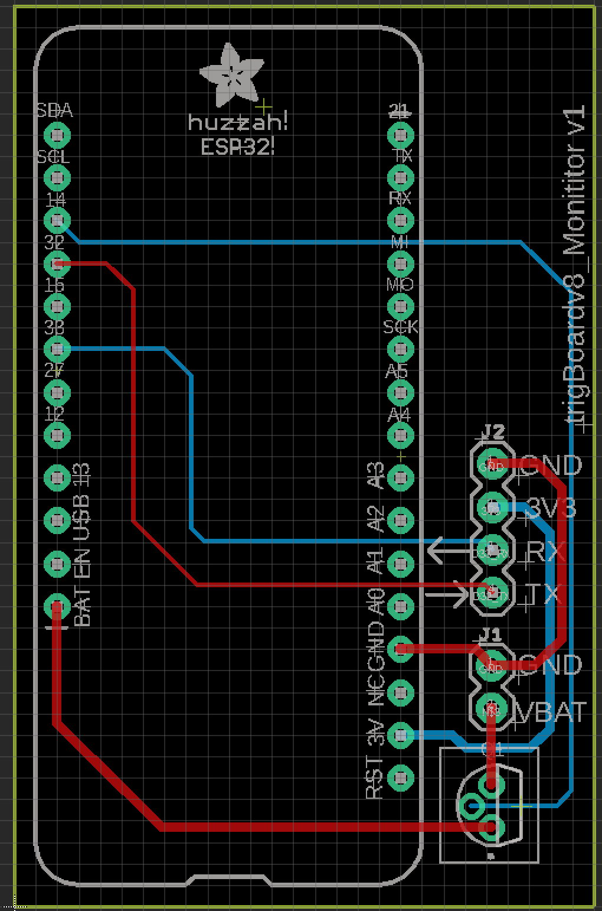
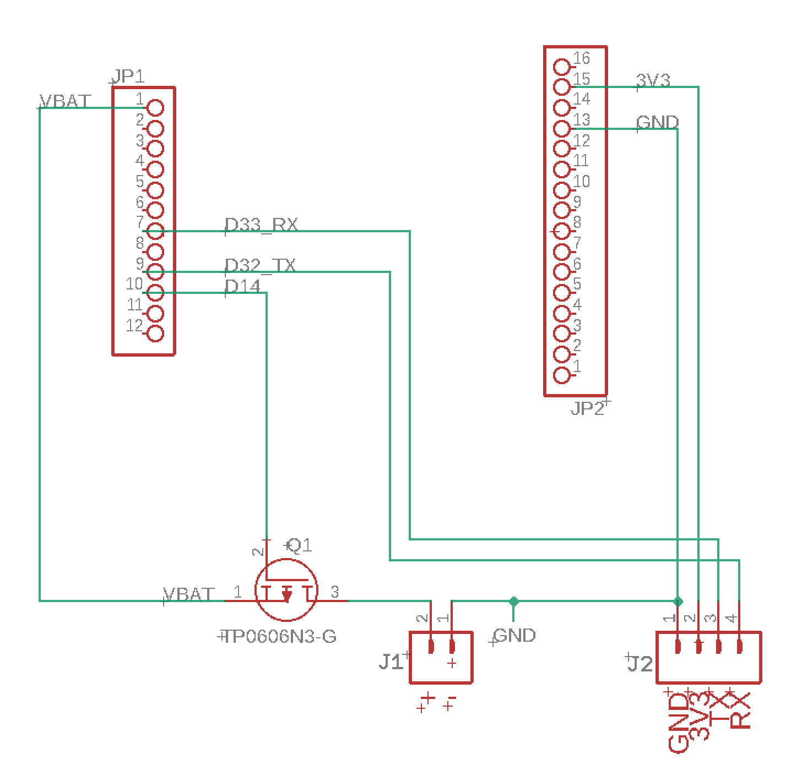
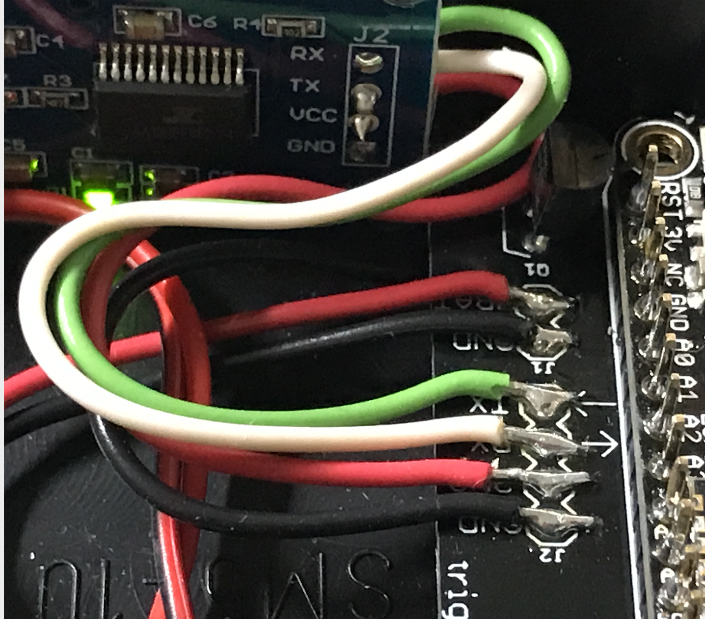
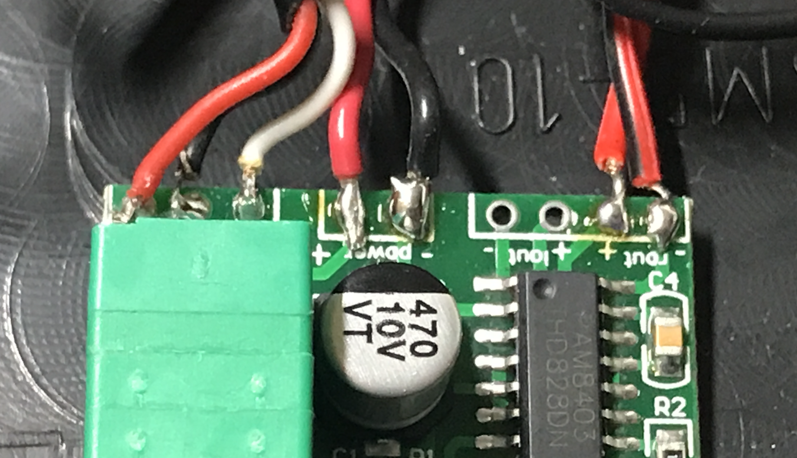
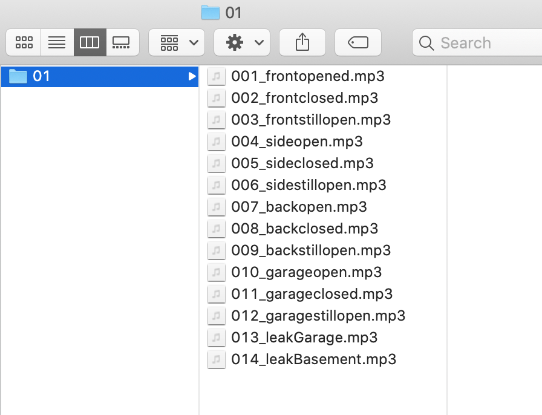
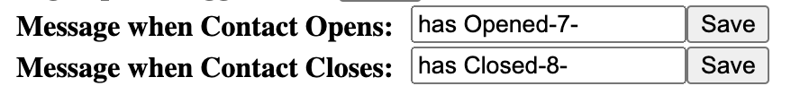

.. _CellularBattery:

=======================================
Cellular/Battery Backed System UDP/TCP
=======================================

.. image:: images/cellularBlockDiag.png
	:align: center

This is actually the preferred method for using the trigBoard - a complete low power system that relies on no existing WiFi/Internet and can even get push notifications out when there is a power outage!

* A central Gateway is installed in the system, where an ESP32 is configured to be a WiFi Access point.  By default, the SSID is hidden for security purposes.  This also means this is a private network hosted in the trigBoard system, meaning any existing WiFi is not relied upon.

* trigBoard communication to the gateway is done using UDP messaging.  This is very fast, and since no cloud communication is needed, the trigBoard message can be sent out very quickly and it can go back to sleep faster (saves battery life). This can be setup from the configurator with the base firmware.

* A `Particle Boron <https://store.particle.io/collections/cellular/products/boron-lte>`_ is also on the gateway to provide cellular connectivity to send push notifications without the need for existing WiFi/Internet connection.  At the time of writing this, the data plan from particle is $3/mo

* Local monitors in the system can play mp3 files based on what even took place.  Like if the Front Door is opened, these monitors will immediately play a custom mp3 "The Front Door has Opened"  These work on the same private WiFi network hosted by the gateway - when a message is received by a trigBoard sensor, it is immediately forwarded out to monitors.

* Battery Backed! Obviously all trigBoard sensors are all on batteries, but the gateway is battery backed by the on-board Particle Boron battery connection. The monitors are also battery backed with the use of Adafruit's ESP32 Feather board having on-board battery connection and USB charging.  

* KD Circuits has designed simple carrier boards for gateway and monitor boards - just bare PCB here, but easy to solder together with all through hole components.  $2/pc `contact KD Circuits directly <https://www.kdcircuits.com#contact>`_

.. note::
	**TCP was added** in trigBoard base firmware 12/20/20 so now ultra reliable communication between trigBoards and the gateway can be achieved.  Surprisingly, the added handshaking involved with TCP does not significantly increase the on-time of the trigBoard - still can be less than 2seconds.  See :ref:`Battery Page <Battery>` for plots comparing the two methods.  Everything you see below still applies - same hardware setup, just different firmware. 

**Here's a full step by step tutorial**

.. raw:: html

    

    <iframe width="560" height="315" src="https://www.youtube.com/embed/-oMSD9I4RSo" frameborder="0" allow="accelerometer; autoplay; encrypted-media; gyroscope; picture-in-picture" allowfullscreen></iframe>
    

trigBoard Setup
----------------

This is actually the easiest part! The messages are sent out via UDP, so setup the trigBoard as you normally would, but just enable udp from the configurator.  Timer settings, open/closed, etc... are all however you want them to work.

.. note::
	| Three things need to be decided
	| 1-SSID will be whatever you want - pick something random like "ajhagwiuycgwerilucberw" just don't use special characters
	| 2-Password also something random- AT LEAST 8 characters and nothing special
	| 3-Port for the UDP messaging, I just use 1234 port is fixed to 80 for TCP
	| 4-TCP will have a value for retries - may want to set this to 10
	| **Write these down somewhere, we'll need them for setting everything up**

| Here is my setup:

.. image:: images/udpSetup_cell.png
	:align: center

* **SSID** Custom SSID to be used for this private network.  This is only used by trigBoards in this system, so do not use your existing WiFi credentials here.  Make something up that is totally random.  try to use just letters and numbers, like "hgkjgKJGH687G" at least 8 characters.  Keep this information somewhere secure, since we'll need to set everything else up and other trigBoards in the future.

* **Password** Same as SSID, something random, at least 8 characters like "jklhoilhJLKHHj8907h"     

* **Static IP** You can set this to 192.168.4.102 if you'd like, or give each of your trigBoards something like 192.168.4.102, 192.168.4.103, 192.168.4.104  Just make sure to start at .102 and you could even give each trigBoard the same ip address.  The only risk there is if two trigBoards are triggered at the same exact time and both have the same static IP address.

* **Target IP** Must be  192.168.4.1 - this is the ip Address of the gateway where the messages are all sent

* **Target Port** You can set this to anything you want, but I normally set to 1234

* **Subnet** Set to 255.255.0.0

* **Primary DNS** Set to 8.8.8.8

* **Secondary DNS** Set to 8.8.4.4

* **Blast Count** Here is where you can get creative - UDP is a one way kind of message service, so how do we know the message got through? Well we don't and would take too much time to acknowledge back and forth, so best to just send a blast of messages!  I recommend 10-25 messages for this.  The battery calculations were done with a 20 message blast.

* **Time Between Blasts** This is the time between each message as they're sent out.  10 has worked pretty good for all of my testing.

| **How to set which mp3 to play on which event**
|	If using a Monitor to play mp3 files, setting this is done on each trigBoard through the configurator.  Very Easy! Each file on the SD card starts with a number, so these numbers are added in to the messages you set in the configurator: 

.. image:: images/mp3message.png
	:align: center

So you can see -5- or -7- or -2- is appended to the messages. If you don't want a certain message to be played by the monitor, just don't add the number

Gateway Setup
----------------
.. image:: images/gatewayPic.JPG
	:align: center

**********************
Hardware Needed
**********************
|	 * trigBoard is ideal for the Private network side, but you can adapt this to any ESP32 board
|	 * `Particle Boron <https://store.particle.io/collections/cellular/products/boron-lte>`_
|	 * A good sized Lithium battery - you can see above that use a giant 5000mAh battery.  The bigger the better so that if you loose power, it will run for a long time.  **The Battery plugs into the Particle Boron** which supports the Adafruit Feather form factor, so any of the batteries `they sell <https://www.adafruit.com/category/574>`_ will work - always double check polarity though!! 
|	 * You can make life a lot easier if you purchase a gateway carrier board from KD Circuits - then just some spare headers are needed to solder down the trigBoard (see picture above)

| **This is the PCB Design for reference:**

	.. image:: images/BoronCarrier.png
		:align: center

.. note::
	Expansion pins from the trigBoard are brought out specifically for adding lights/alarms/etc... or even a "silence button/switch"

.. warning::
	Do not connect anything to the trigBoard's battery or sensor connectors! The battery backup is provided by the Particle Boron and continuous power is through the Boron's micro USB port (just like the picture above)

| **Silent Button/Switch**
| This is completely optional, but the gateway code supports a silent button/switch to prevent messages from being sent out only to the monitors.  If you have these monitors installed throughout the house and you have a trigBoard mounted on a high-traffic location, the monitor can get pretty annoying!  Note that this code only silences the monitor, not the particle, so the push notifications still go out.  In the code, it's easy to see how this works though, so you can make this operate however you may need.  
| The switch is wired from GND to GPIO12 where CLOSED = SILENT

	.. image:: images/silentButton.png
		:align: center

***************************
trigBoard Gateway Software 
***************************

UDP version `UDP Gateway Git Repository <https://github.com/krdarrah/trigBoard_GatewayV8>`_

TCP version `TCP Gateway Git Repository <https://github.com/krdarrah/trigBoard-Gateway-TCP>`_

.. note::
	* This is all based on the Base Firmware, so make sure you have all of those dependencies and versions of libraries installed first.

	* I use the same board settings as well

	* **Software Serial** is used to communicate to the Particle Boron, so for the ESP32, I had to install EspSoftwareSerial first before compiling:

	.. image:: images/EspSoftwareSerialImg.png
		:align: center
		
	* USB-Serial Programming is recommended

	* TCP version will need to install the `ESPAsyncWebServer <https://github.com/me-no-dev/ESPAsyncWebServer>`_ and `AsyncTCP <https://github.com/me-no-dev/AsyncTCP>`_ Libraries

 

**UDP version** - Configuration of the trigBoard settings is also done through the configurator! On bootup, you'll notice the Blue LED flashing - it will do this for about 5 minutes, allowing you to connect to it through the google chrome `Configurator Tool <https://kevindarrah.com/configurator/>`_  You should see trigBoard Gateway now in the scan list. 
	
	Because this is a Gateway acting as the Access Point, you will not be connecting to any SSID, instead you will specify the SSID and password for this private network.  Most of the functionality in the configurator - you set this here in WiFi SSID and Password - then click "Save and Connect..."

		.. image:: images/gatewayWiFiSet.png
			:align: center   

	Then the only other setting is when you enable UDP, you can set the port number. **ALL OTHER SETTINGS DO NOTHING**

.. note::
	After saving the WiFi Settings for the gateway, **YOU HAVE TO PRESS THE RESET BUTTON ON THE TRIGBOARD**  This is because, the settings won't take effect until the board boots up.  You can test things at this point with the USB-Serial Converter and look at the Serial Monitor debug window.  When a trigBoard sends a message to it, you should see some activity!

**TCP version** SSID and PW are set in the AP tab: 
	Serial.println(WiFi.softAP("ssid", "password", 1, 1, 8)); //ssid,pw,ch,hid,conn 

**********************
Particle Software 
**********************

This part is very easy once you get your Particle Boron Commissioned - follow the particle tutorials to get all set up and running so that you see the breathing Cyan LED on the board.  It would be a good idea to at least get familiar with flashing code to the Boron from their `web IDE <https://build.particle.io/build/new>`_

Then all you'll do is paste the code in below, check you have the right board selected (bottom right of IDE), and flash the board by clicking the lightening bolt symbol (upper left of IDE)

.. code-block:: C
		
	String str1,str2;

	void setup() {
	    Serial.begin(115200);//debug
	    Serial1.begin(9600);//from trigBoard  on TCP version this is 57600
	}

	void loop() {
	  if (Serial1.available() > 0) {// new data came in
	     Serial.println("New Data");
	     str1 = Serial1.readStringUntil(',');//that's the separator
	     str2 = Serial1.readStringUntil('#');
	     sendData();
	     Serial1.flush();
	  }
	}

	void sendData(){
	     unsigned long startConnectTime = millis();
	     char pushMessage[50], pushName[50];
	     str1.toCharArray(pushName, str1.length() + 1);
	     str2.toCharArray(pushMessage, str2.length() + 1);
	     Serial.println(str1);
	     Serial.println(str2);
	     
	     String adaFruitData = "[{\"key\":\"house\", \"value\":\"";
	     adaFruitData.concat(str1);
	     adaFruitData.concat("\"}]");
	     Particle.publish("homeSecurityPost", adaFruitData, PRIVATE, NO_ACK);
	     
	     String pushoverPacket = "[{\"key\":\"title\", \"value\":\"";
	     pushoverPacket.concat(str1);
	     pushoverPacket.concat("\"},");
	     pushoverPacket.concat("{\"key\":\"message\", \"value\":\"");
	     pushoverPacket.concat(str2);
	     pushoverPacket.concat("\"}]");
	     Particle.publish("pushover", pushoverPacket, PRIVATE);//then send to push over so we get the notifications on our mobile devices

	     Serial.print(millis() - startConnectTime);
	     Serial.println("ms to connect");
	}

This code receives data from the trigBoard then sends out to the cloud - both to Pushover and to AdafruitIO.  Why both? Well you may want to do other things with this data, so Adafruit can keep a log of all of the notifications and you can tie that to other things around the internet like IFTTT or even notify other trigBoard systems.  Like let's say you have a remote system setup and you want your local monitors to speak when something in that location occurs.  You can have one Master system configured to also monitor an Adafruit feed to push data back out from the gateway to the monitors. And Adafruit's service is free, so we can set that up now and expand the system later on.  Let's set these things up now: 

1) Set up and account at `io.adafruit.com <https://io.adafruit.com>`_

2) You'll see something in there where to get your Adafruit IO Key - we'll need this later for the webhook from Particle to send data here

3) Create a new feed and call it something - this is where all notification data is sent - in my code above, all data is sent to the feed named "house".  You can change this, but just make sure you also change in the code.

4) You probably already have this setup, but go and set up an account with `pushover.net <https://pushover.net>`_ - the push notifications will be sent here. We'll need both the user and API keys - :ref:`go here  <Pushover>` for instructions on where to get those

5) So now we're all setup to create the webhooks needed for the Particle Boron to send data out to Adafruit and Pushover.  Head over to `Integrations <https://console.particle.io/integrations>`_ and create a new one and select Webhook. The Event Name can be whatever you want, but note that my Boron Code above is calling "homeSecurityPost", so if you do change this, make sure to also change in the code. The URL is setup like this: https://io.adafruit.com/api/v2/krdarrah/groups/feeds/data 

See the "krdarrah" in there? that's where you'll put your adafruit user name, and also make sure your settings look like this:

.. image:: images/adafruitWebhook.png
	:align: center

Expand the advanced settings and set the custom JSON data to look like this: 

.. code-block:: JSON

	{
	  "feeds": [
	    {
	      "value": "{{{0.value}}}",
	      "key": "{{{0.key}}}"
	    }
	  ]
	}

Scroll down to the HTTP HEADERS and ADD ROW twice, so that you can add your Adafruit IO key and Host:

.. image:: images/adafruitHeaders.png
	:align: center

Everything else can be left alone, so you can save this and should be good to go with Adafruit IO.  Let's create the Pushover Webhook next, so follow that same process in creating a new webhook with the Event Name called "pushover", URL = https://api.pushover.net/1/messages.json and change the settings so it looks like this:  

.. image:: images/pushoverwebhook.png
	:align: center

Next, we'll go to the advanced settings and and add a couple rows and set this up like:

.. image:: images/pushoverForm.png
	:align: center

You'll notice where you paste in your user and API tokens from pushover.net.  You can also change the sound of the notification, but I've only ever used the bike sound, so not sure what options you have here.  

Everything else can be left alone, so save this and you now have both webhooks good to go! 

Monitor Setup
----------------

The monitor is what really makes this cellular system come together.  These can  play any mp3 file you want based on a trigBoard event (see above for the trigBoard setup for how to assign mp3 files).  I like to have these files be announcements like "The front door has opened", "The garage is still open", etc... What's also nice about the monitor is that it is also battery backed and connects to the same private network as the trigBoards do back to the gateway. A "broadcast" UDP message is sent out from the gateway to all listening monitors with instructions as to which mp3 to play.  

.. image:: images/monitorhardware.png
	:align: center

**********************
Hardware Needed
**********************

* This is actually based on `Adafruit's ESP32 Feather board <https://www.adafruit.com/product/3591>`_ Why? well because this has the battery connector and charging already on board.  

* And you're going to want a battery as well - might as well get one from `adafruit <https://www.adafruit.com/category/574>`_ I would say 1000mAh or so would give a couple hours of backup power, but feel free to go as big as you want here.  

* YX5300 mp3 board like this: 

Ideally, this is a genuine YX5300 based board, but these are hard to find.  Most will have a chip marked with some kind JC... These are not as good and don't support all of the same commands as the YX5300... some say JC stands for "Just Crap"  Either way, I was able to get my Monitor Code to work with both, so you should be fine - just search ebay/amazon/etc for YX5300 and you should see a board that looks like this.  Also, don't forget a microSD card - nothing special or too big. You won't need a lot of space... 

* For the amplifier/speaker, I use these little kits based on the PAM8403

* In a quiet bedroom, you want this to be completely silent (no speaker hum), so I simply kill power to the amplifier with a P-Channel Mosfet - `TP0606N3-G <https://www.digikey.com/product-detail/en/microchip-technology/TP0606N3-G/TP0606N3-G-ND/4902382>`_

* A monitor carrier board from KD Circuits makes this project a lot easier.  Everything is all setup for the Adafruit Feather board, connections to the YX5300 board and P-CH MOSFET switch power to the Amplifier - contact KD Circuits for more info on this board.  Here is the design for reference:

**********************
Connections
**********************

=============== ================
Adafruit ESP32  YX5300 mp3 Board
=============== ================
GND             GND
3V3				VCC
33 (RX)			TX
32 (TX)			RX
=============== ================

The 3.5mm audio jack that comes with the PAM8403 kit can be used to plug into the output of the YX5300 board and wire into the audio input of the PAM8403 amplifier board:

================== =======================
3.5mm Audio Cable  PAM8403 Amplifier board
================== =======================
WHITE				L
BLACK				G
RED 				B
================== =======================

Then the power for the PAM8403 amplifier will wire from the drain of the P-CH MOSFET, and hook up the speaker (I use the right channel only)

Then that's all there is to it! You can keep power always on with the USB cable to the Adafruit ESP32 board (and also keeps the battery charged)

********************************
Adafruit ESP32 Monitor Software
********************************

UDP Version -  `trigBoard Monitor UDP Git Repository <https://github.com/krdarrah/trigBoard_MonitorV8>`_

TCP Version -  `trigBoard Monitor TCP Git Repository <https://github.com/krdarrah/trigBoard-Monitor-TCP>`_

***Big thanks to the YX5300 code found here!*** `salvadorrueda github <https://github.com/salvadorrueda/ArduinoSerialMP3Player/blob/master/ArduinoSerialMP3Player/ArduinoSerialMP3Player.ino>`_

Just like the Gateway software, all of the same dependencies are needed as well as the ESPsoftware serial library.  If you can compile the gateway software, then you should be fine here.  I also use the same board settings as the trigBoard.

And just like the gateway, this board is also configured through the Configurator!  On bootup, you'll see the LED flashing on the board (for 5min)- only when this is flashing can you connect to it from the Configurator.  Only a few settings are needed:

* Use the main WiFi Settings at the top of the configurator to connect to the private network.  You can set this to use a static IP if you want, but I recommend DHCP (static IP box unchecked). This actually appears to operate with faster response times from the server.

* Scroll down and enable UDP.  All of these settings are not used, except the port. Most people use 1234, but if you're using something else, you can change here.  TCP does not use any of these settings.

********************************
mp3 files
********************************

These can be anything you want, but I like the announcements "The Front Door has opened"  I create these mp3 files here: `ttsmp3.com <https://ttsmp3.com>`_

Now, these files need to be named and follow a very specific file directory on the SD card. Everything is about keeping the files in order, so create a folder and name is "01" and place all of your mp3 files in there.  Recall that each trigBoard message calls out a number, which corresponds to a specific mp3 file.  You can just name these 000,001,002,003, etc... or do it like how I have it here: 

Then let's take an example -  you see how I set the trigBoard up to play "The backdoor has opened" and "the backdoor has closed" again, you just append the message with a -#- where # is the track number

.. note::
	I actually keep the exact files I use as part of my source code - so you can use those files as well if you want!

Repeaters - Range Extenders
----------------------------

If you need better range with this system, you can add repeaters.  I found some NAT router code for the ESP32 that seems to work pretty good, so I loaded this up on a couple Adafruit ESP32 boards (with batteries).  You can find that code on `martin-ger git page <https://github.com/martin-ger/esp32_nat_router>`_

Then load the binaries directy onto an ESP32... I have plans on making a video testing the capabilities of using these, like do they actually work for this trigBoard application? I've had them installed for months without issue, but not sure if all trigBoards communicate directly with the gateway or through the repeaters.  I did get a chance to test this out: 

.. raw:: html

    

    <iframe width="560" height="315" src="https://www.youtube.com/embed/YHjM2KAqjU0" frameborder="0" allow="accelerometer; autoplay; encrypted-media; gyroscope; picture-in-picture" allowfullscreen></iframe>
    

