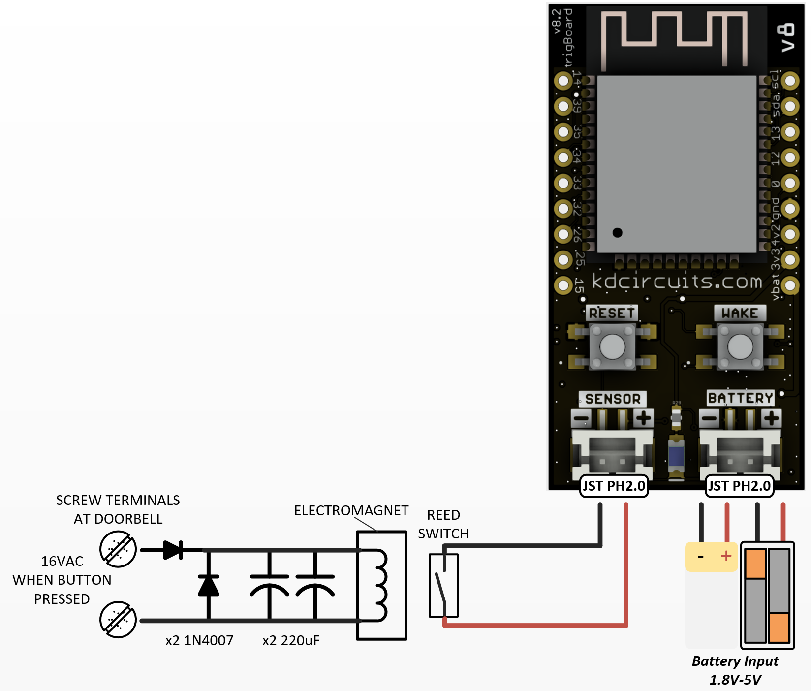
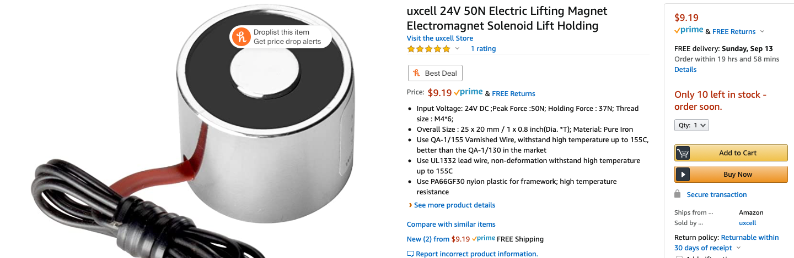
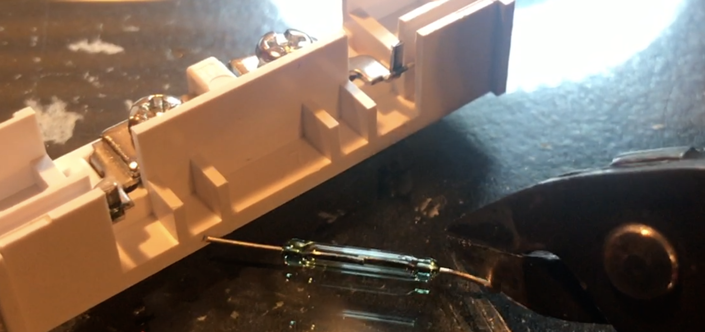
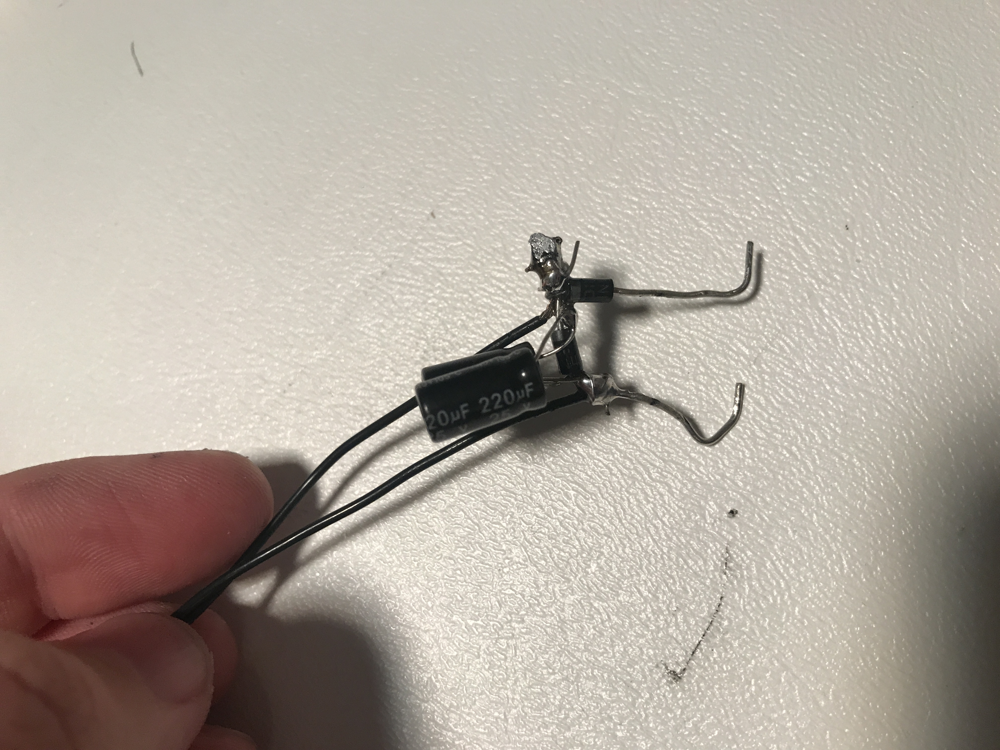
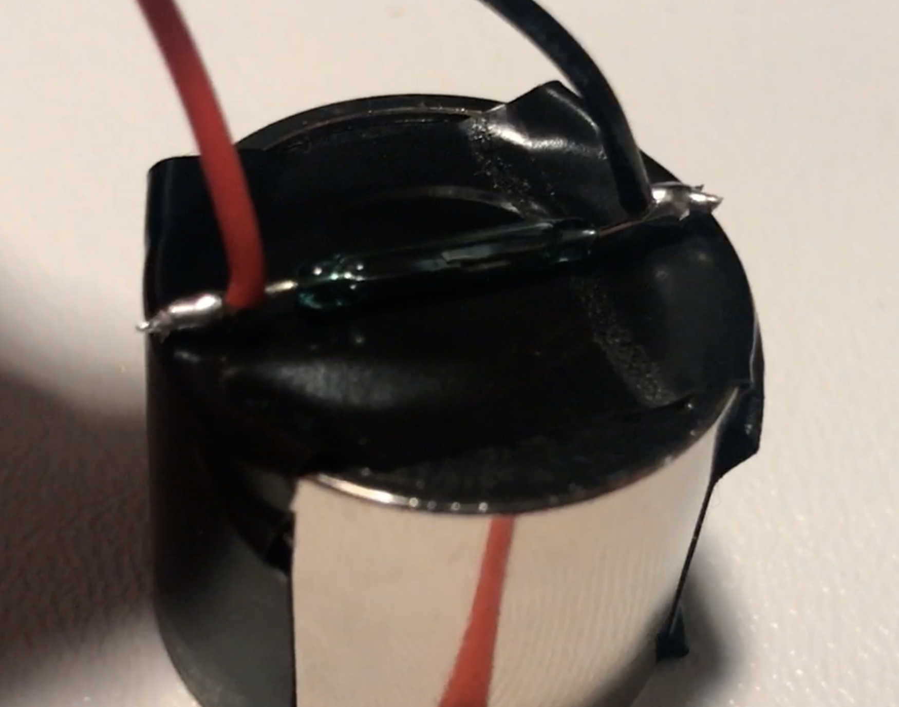
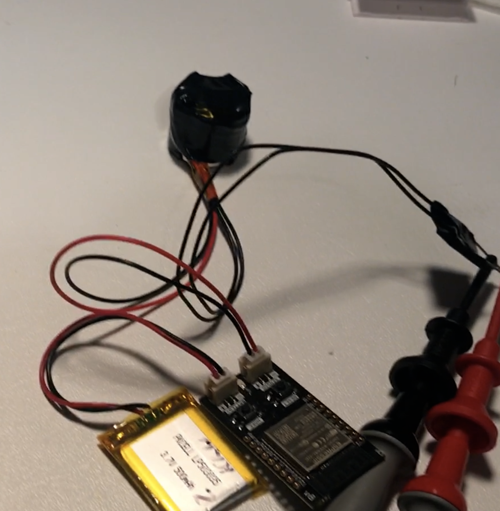

=========================================
Door Bell Monitoring
=========================================

Simple as it sounds - get a push notification when the door bell rings! Most doorbell systems are AC powered by a step down transformer off of AC MAINS to ~16VAC.  Be careful with your wiring make sure to disconnect power before making connections and also note that your system may be different!  The trigBoard has a simple dry contact trigger input, so this circuit works by 1/2 have rectifying the 16VAC, so we have a DC voltage to excite the electromagnet.  A couple capacitors smooth that out somewhat and a flyback diode in there takes care of the collapsing field when you release the button.  

**Parts**
----------

- Diodes are just simple `1N4007 <https://www.digikey.com/product-detail/en/nte-electronics-inc/1N4007/2368-1N4007-ND/11645794>`_ but it's nothing special, so just as long as it can block ~24V or so, it  should work.  

- Capacitors are 220uF Electrolytics, MAKE SURE THEY ARE AT LEAST 24V RATED.  `These <https://www.digikey.com/product-detail/en/würth-elektronik/860020574012/732-8946-1-ND/5728889>`_ would be good

- Electromagnet is rated for 24VDC, even though we're hitting with less voltage, it's still enough to trip the reed switch.  `Just a cheap one from Amazon <https://www.amazon.com/gp/product/B01MT8FNT0/ref=ppx_yo_dt_b_asin_title_o02_s00?ie=UTF8&psc=1>`_

- trigBoard and Reed switch from Tindie store - I actually snipped the bare reed switch out of the magnetic sensor, to get it closer to the electromagnet.

**Install**
------------

I was able to build the circuit just by twisting all of the leads together - watch your polarity on everything: 

Then just taped that all up to make it safe leaving the two leads exposed to connect to the doorbell terminals.

I found that the reed switch needs to installed very close to the center of the electromagnet plate.  And also the orientation is important - the magnet needs to pull the contact closed, so make sure you have it like this with electrical tape on the electromagnet so you don't short out the switch leads:

Once that's taped down, just cover and tape the whole thing down and you're good to go!

Will post pics of it in the doorbell and video soon

**Programming**
----------------

Well none needed! The base firmware out of the box will work! Just choose the way you want to be notified from the supported services page and just set to only wake on Contact Closing and give it a message!
