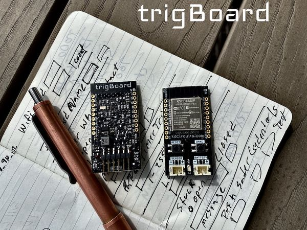

.. trigBoardDocs documentation master file, created by
   sphinx-quickstart on Thu Jun 18 19:00:23 2020.
   You can adapt this file completely to your liking, but it should at least
   contain the root `toctree` directive.

trigBoard v8
=========================================

The trigBoard is an extremely low power platform for the ESP32 WiFi+Bluetooth Module. This board is perfect for battery powered applications, due to it's single digit uA standby current draw ~1.5uA with a 3V battery input. To give an idea as to how low this current draw is, a cheap smoke detector pulls about 7uA. This board was initially designed to be the ideal IoT device - a WiFi connected battery powered monitoring solution for dry contacts (door/window sensors), where a push notification is immediately sent when the contact state has changed. The ultra low standby current does not change regardless if the contact remains in the closed/opened state (this is part of the secret sauce in the trigBoard design). But of course, the trigBoard is a playground of low power features, so it can easily be adapted to a unique monitoring application:

.. raw:: html

    

    <iframe width="560" height="315" src="https://www.youtube.com/embed/CD-jmSkM3d4" frameborder="0" allow="accelerometer; autoplay; encrypted-media; gyroscope; picture-in-picture" allowfullscreen></iframe>
    

* Many battery options, with input voltage range from 1.8-5V. Great for two AAA batteries or even a rechargeable Lithium cell at 4.2V. Reverse polarity protection built in, so no issues if batteries are plugged in backwards. See :ref:`Battery Page <Battery>` for more information and calculations

* Multiple wake sources all configurable through software (no solder jumpers)

* Dry contact trigger input supporting BOTH contact OPEN and contact CLOSE, but configurable for either or both, so if for example a garage door was monitored, a push notification could go out for when the garage opens AND when the garage closes.

* The board utilizes an actual **RTC** (Real Time Clock). This is a high quality RTC, so accurate wake times can be configured. The timer wakes the board up at the configured time - for example once and hour, then checks the battery voltage and if low, will send out a push notification. The timer can also be used to check the current status of the contact and send out a notification, so in the garage door example, the board can be configured to not only send out notifications when the door opens/closes, but also when the garage is left open for some period of time after the door was opened.

* Wake button on board can also be used to send out a push notification.

* Unused pins from ESP32 broken out for future expansion and in-line to fit breadboards - developer friendly.  See :ref:`Pinout page <Pinout>` for more information

* Base Firmware supports many Push Notification service options like :ref:`Pushsafer <Pushsafer>`, :ref:`Pushover <Pushover>`, and :ref:`IFTTT <IFTTT>`. And even develop a custom solution with :ref:`MQTT <MQTT>`, :ref:`UDP <UDP>` or :ref:`TCP <TCP>`. Any of these can be enabled, or even multiple. For example, the notifications can go out through Pushover, then a secondary backup notification can go through MQTT. Or even a notification though Pushsafer, then turn the lights on in the house with IFTTT. The possibilities are endless with this.

* :ref:`Configurator Tool <Configurator>` gives full control over the board parameters and settings - in a nice clean easy to use GUI through Google Chrome and a Bluetooth connection to the ESP32.

* Made in the USA

* ESP32 Module is FCC Certified and trigBoard has been scanned independently

Mentions
----------
  * `hackster.io <https://www.hackster.io/news/kd-circuits-new-trigboard-v8-marks-a-major-overhaul-of-the-flexible-iot-notification-board-4ca4d9a147ea>`_ KD Circuits' New trigBoard v8 Marks a Major Overhaul of the Flexible IoT Notification Board

Contents
========

.. toctree::
   :maxdepth: 2 
   :caption: trigBoard v8 Docs

   wheretobuy.rst
   quickstart.rst
   configurator.rst
   supportedServices.rst
   Hardware.rst
   Firmware.rst
   testing.rst
   contact.rst

.. toctree::
   :maxdepth: 2 
   :caption: Projects

   ePaperCoronaDisplay.rst
   cellularProject.rst
   doorbell.rst
   garage.rst
   motionSensor.rst
   multipleInputs.rst
   temperatureSensor.rst
   waterleakDetector.rst
