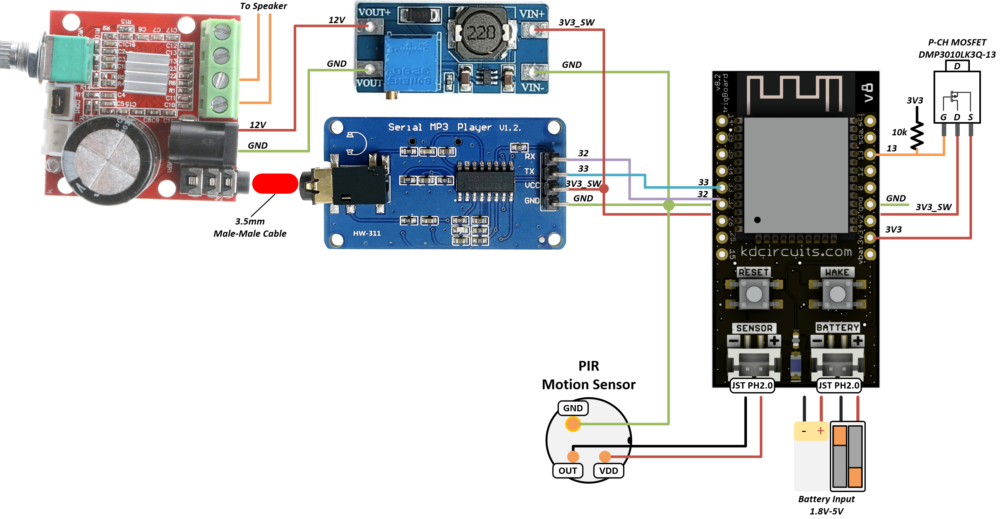
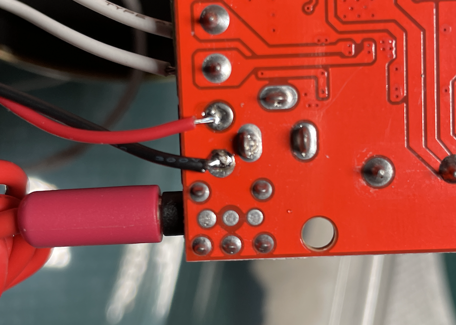

=====================================
Motion Activated mp3 Security System
=====================================

.. raw:: html

    

    <iframe width="560" height="315" src="https://www.youtube.com/embed/shOsIt5IQ-8" frameborder="0" allow="accelerometer; autoplay; encrypted-media; gyroscope; picture-in-picture" allowfullscreen></iframe>
    

This is a pretty cool project - an ultra low power 2uA motion sensor system that plays any mp3 you want when motion is detected.  Also has ability to only play the file during certain hours of the day and because it's based on the ESP32, you can also send push notifications.  

.. image:: images/dogBarkPicture.png
	:align: center

Parts Needed
---------------
| - `mp3 Player Board <https://www.amazon.com/dp/B0725RHR4D?psc=1&ref=ppx_yo2_dt_b_product_details>`_
| - `DC to DC Booster Module <https://www.amazon.com/dp/B099K3P7MG?psc=1&ref=ppx_yo2_dt_b_product_details>`_
| - `10W Audio Amplifier <https://www.amazon.com/dp/B06XGL2L1S?psc=1&ref=ppx_yo2_dt_b_product_details>`_
| - `Ultra Low Power PIR Sensor <https://www.digikey.com/en/products/detail/panasonic-electric-works/EKMB1103113/2601873>`_
| - Speaker is nothing special.  I experimented with a few random speakers I had lying around.  
| - Recommend using a pretty large battery for this, just because of the high peak currents when the trigBoard wakes up.  >2000mAh

Connections
-------------

	.. warning::
		The DC-DC booster modules need to be preset before installation.  The 3.3V pin on the trigBoard is only enabled when triggered, so you can wire this to the booster module, but **DON'T** connect the output, until you adjust it for 12V using the trimpot.  I did this with the trigBoard and just held the wake button until the LED starts flashing. That will keep the 3.3V rail up while you adjust the booster output.  Then you can disconnect the battery and finish the connections.  

|	:download:`Download Diagram <images/dogBarkDiagram.png>`

Note that the 12V connection is soldered directly to the amplifier board:

Source Code
--------------

:ref:`See Firmware Page for how to upload <Firmware>`

| `Customized Base Firmware HERE <https://github.com/krdarrah/trigBoardV8_BaseFirmware_DOGBARK>`_

	.. note::
		This code adds support for the mp3 player board as well as using the RTC (Clock) to check the current hour so that the dog bark is only enabled during a certain timeframe.  

