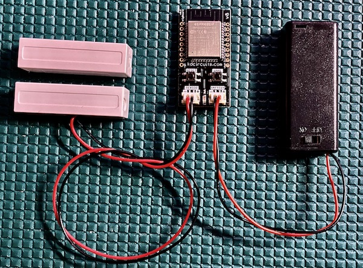

.. _Quickstart:

=======================
Quickstart
=======================

Out of the box setup:

.. raw:: html

    

    <iframe width="560" height="315" src="https://www.youtube.com/embed/nkU9sCDsWzM" frameborder="0" allow="accelerometer; autoplay; encrypted-media; gyroscope; picture-in-picture" allowfullscreen></iframe>
    

| **Hardware Setup** All that's needed here is a battery and a dry contact used for triggering.  Both connectors on the board are standard JST PH 2.0mm Note that the cables may need some force to fully insert.  
| **Battery Selection** A good capacity for the trigBoard is 500-1000mAh, but this depends on how often the board will be triggered.  Any of these Lithium batteries would work from `Adafruit <https://www.adafruit.com/category/574>`_. Or two AA or AAA batteries would work, with a holder like `This <https://www.adafruit.com/product/4191>`_  Note that this battery holder is also available for purchase with your trigBoard as an option :) More details on battery selection can be found :ref:`here <Battery>`
| **Choose a Notification Service** This is where the notification will end up.  For testing, it's easy to simply use Pushsafer or Pushover - see the :ref:`Supported Services Page <Services>` for more information

| **Setting up Configurator** The trigBoard ships with base firmware pre-flashed, so once you hook up the battery, you're all set to launch the :ref:`configurator<Configurator>`.  This works on a bluetooth connection to your computer within Google Chrome.  
| 1 - In Google Chrome from a Mac/Windows/Linux computer, launch the `Configurator Tool <https://krdarrah.github.io/trigBoardConfigurator/>`_
| 2 - Press and hold the wake button on the trigBoard until the blue LED starts flashing
| 3 - In the configurator tool, you will see the connect button, click that and connect to the trigBoard:

 .. image:: images/configuratorTutscan.png
	 :align: center

| 4 - Once paired, you will see the Configurator fully populate with values. Let's work through these one by one: 

.. warning::
	You need to click the save button next to each parameter after changing it

| **WiFi Settings**

 .. image:: images/configWiFisettings.png
	 :align: center

This is self explanatory, but if you're using (Pushover, Pushsafer, or IFTTT) then the trigBoard will connect to the WiFI network selected here using DHCP.  If you would rather use a static IP, you can also enable this by selecting the check box.  Most users just use DHCP, but may have faster connection times by using a static IP:

 .. image:: images/sttaticIPsettings.png
	 :align: center

| **Board Settings**

 .. image:: images/WifiTimeoutSetting.png
	 :align: center

This is the time the trigBoard will wait before failing to connect to the WiFi network and going back to sleep.  For most users, 5 seconds is good enough.  Just be careful to not make this too big because if you ever relocate the trigBoard to a new location and need to reconfigure, you'll have to wait for this timeout before the configurator mode is enabled.  I would suggest starting with 5 seconds and if you notice missed events, increase to 10 seconds.  If that still gives trouble, then there may be a problem with the WiFi router or signal strength at this location.  

 .. image:: images/trigBoardName.png
	 :align: center

This is the name that will be sent along with the push notification message - normally would be "Front Door" "Garage Door" "Mail Box"

 .. image:: images/wakeon.png
	 :align: center

The trigBoard will wake on any change of the sensor input - open and close.  This setting here is used to decide if a notification is sent. This depends on the application and how you're planning to use the trigBoard.  For a mail box, just open detection might make sense, but for a garage, both open and close would be useful.  

 .. image:: images/messagesforwakeandclose.png
	 :align: center

When you select which to wake on, the messages are enabled for that selection. These could be "Has Opened" or "Has Closed", because the firmware will combine the trigBoard name with this message.  "Garage Has Opened"

 .. image:: images/highSpeedTrigger.png
	 :align: center

Warning! This feature was added for very specific applications where the sensor input rapidly opens and closes.  Most users would leave this unchecked.  There is a complex analog trigger system designed into the trigBoard and it normally detects the wake event based on the current status of the contact.  But in some applications, the contact opens and closes very quickly.  For this, the high speed trigger will change to use latched circuitry to determine the wake event.  But again, this is more for specific applications and should be left unchecked.

 .. image:: images/buttonPressed.png
	 :align: center

A message is also sent when the wake button is pressed - this is what that message will be.  This is very useful for testing the board and some users have written custom firmware to use the wake button for more advanced features.  

 .. image:: images/timerunittimer.png
	 :align: center

The timer on the trigBoard is extremely useful.  This automatically wakes the board up at a specific interval to check various conditions like low battery or if the contact is still closed/open.  It is HIGHLY recommended to keep this value as high as possible, so if a check of once an hour (60 minutes) can work for your application, then set for that.  Some applications like a checking if the garage door is still open may need a faster interval like 15 minutes, but just note that this will have some impact on battery life. So ideally the units are set to Minutes, but Seconds were added in as an available feature.  Note that this can be useful when developing your own firmware for waking the board automatically when uploading to the board. Like I'll set to 10seconds when developing, so I never have to physically wake the board to upload.  

 .. image:: images/timerwakemessagess.png
	 :align: center

If the timer has been enabled to check contact status, then these are the messages that will be sent - usually set to "is Still Open" or "is Still Closed", then the combined message might be "The Garage is Still Open"  For most applications monitoring doors/windows, the check for if the contact is still open is the only one used.  

 .. image:: images/lowbatteryThreshold.png
	 :align: center

This is the threshold that if the battery is less than this value, a BATTERY LOW message is sent out at the timer interval.  Because the trigBoard supports a wide variety of battery options, a setting here needs to be set.  For a 4.2V rechargeable lithium battery, maybe 3.3V or so would work.  Then for two AA/AAA batteries, set for 2.5V

5 - The remaining settings determine the push notification service, so see :ref:`Supported Services Page <Services>`  Note that the "Battery Voltage Calibration Offset" is set during factory programming. 

6 - Don't forget to Disconnect from the Configurator when complete!  The device does not send notifications while the Configurator is active

