=============================
Solar Powered
=============================

trigSolar
--------------

.. image:: images/trigSlareverything.png
	:align: center

With the ultra low power capabilities of the trigBoard, it only makes sense to match it up with solar power!  The trigSolar board was specifically designed with trigBoard in mind for both outdoor and indoor solar applications.

* Based on the `Texas Instruments BQ25570RGRR <https://www.ti.com/lit/ds/symlink/bq25570.pdf?ts=1622226249291&ref_url=https%253A%252F%252Fwww.ti.com%252Fstore%252Fti%252Fen%252Fp%252Fproduct%252F%253Fp%253DBQ25570RGRR>`_ Energy Harvesting IC with MPPT (Maximum Power Point Tracking) and <1uA Quiescent Current Draw.  Configured for 80% MPPT by default (most common for solar panels)

* Built-in 2.5F High Quality Super Capacitor - allowing for continuous charge/discharge cycles with minimal degradation across a wide operating temperature range.  Can be operated with only a super capacitor making for a battery free IoT system!  

* Charge voltage set to 5V, but can be customized with simple component changes

* Automatic Switchover circuit to battery backup for mission-critical applications, in situations where the super capacitor may fully deplete. A "DETECT" output signal can be wired to trigBoard (or other host processor) to indicate if on battery backup or solar power NOTE: Battery backup is purely optional and the board does not charge this battery, which is why it can be any battery within 2-5V.  Could be 4.2V lithium cell or a set of AAA batteries.  The board simply gives a smooth uninterrupted switchover to the battery to ensure the notifications continue being sent.  This is a clever circuit because it's not just a "highest voltage wins" kind of circuit like OR'ing diodes, but rather a priority circuit so that it will always use solar power if it's able to, even if the solar power voltage is less than the backup battery voltage.  

* Pre-Charge Button to allow users to charge the super capacitor directly from the battery to set an initial condition for the system - also note that the trigSolar board operation requires >1V of charge on the super capacitor at all times.  This would naturally occur under normal solar charging, but to "kickstart" the board, can simply just hold the precharge button for a few seconds or until the output is enabled.

* Board designed with modifications in mind - JST PH2.0mm connectors for all connections into the board as well as through hole test points, making it easy to wire into custom applications.  Also, components spread out in 0805 packages, so can be replaced "easily" to set the board's various parameters and thresholds for some custom system. Note that it works great out of the box with trigBoard!   

* Super Capacitor can be expanded with simple "reserve' circuit, so the high quality 2.5F capacitor handles the high current loads during wakes, but a much larger and lower quality capacitor can be used as reserve storage to slowly replenish the system's charge.  

* `Indoor PowerFilm Solar Panel LL200-2.4-75 <https://www.powerfilmsolar.com/products/electronic-component-solar-panels/indoor-light-series/ll200-2-4-75>`_ with pre-soldered JST Cable available as option (thoroughly tested here with indoor lighting)

* Lower cost Outdoor panel option (30mm x 38mm) - smaller and cheaper is all that's needed with outdoors - the trigSolar board is incredibly efficient.

* `Fusion360 Design here <https://a360.co/3ftcq1X>`_ pw is trigsolar and you can also download the step file there as well

.. image:: images/trigsolarGIF.gif
	:align: center

**Functionality**
==================

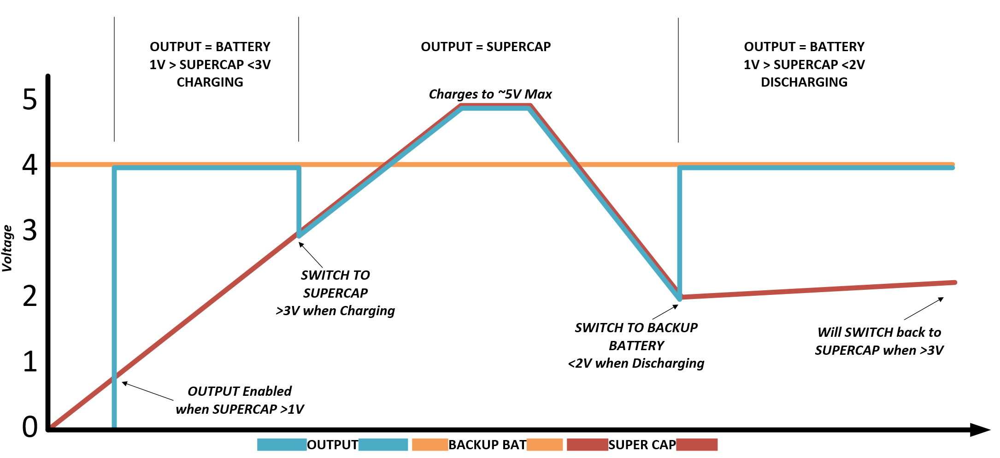

This illustrates nicely how the trigSolar board works - note that this is showing with a battery backup connected.  This is not required, so if no backup is provided, the output just goes to 0V.

1 - The trigSolar board requires >1V to operate, which can be forced with the pre-charge button, just as long as a backup battery is present or can just be left to naturally charge with solar power.  Getting up to 1V does not take long.  Note that in the plot, as soon as 1V is reached, the output is set to the battery backup. If no battery is connected, then the output remains at 0V. **NOTE** there is only one 10ohm resistor to limit inrush current from the battery to the super capacitor.  Do not hold the pre-charge button for too long, since this may burn up that resistor.  One second on, one second off just to get the super capacitor charged up should be good.  

2 - On charging up, the output will switch to the super capacitor at ~3V.  With a backup battery connected, it will switch from battery to super cap, which is interesting to watch happen, since you might have a 4.2V battery connected, then suddenly the voltage drops to 3V.  This is the switchover point and demonstrates the priority circuit in action.  

3 - Now that the board is running purely on solar power (super capacitor), it will continue to use this power until the voltage falls below 2V.  It's not 3V, because a 1V hysteresis was designed into the board. In other words, super cap turns on at 3V on the way up, turns off at 2V on the way down.  Then turns back on at 3V.  This hysteresis is important because when the board charges up to 3V, the trigBoard will immediately wake and attempt to send a notification causing some discharge on the super capacitor.  Without hysteresis, like if it also turned off at 3V, the trigSolar board would never be able to fully switch over and stay powered from the super capacitor.  

**Detect Pin**
==================

This provides an open-drain signal that you can use to determine if the board is outputting power from the Super Capacitor or from Battery backup.  In most cases, this is not used, but can be helpful, for example here is a snippet of code with the signal wired to **GPIO25** on the trigBoard that simply adds a comma separated 1 or 0 to the push message depending on the state:

.. code-block:: C++
  
	pinMode(25, INPUT_PULLUP);// this is the sensor wire from the solar board
	    delay(1);
	    if (digitalRead(25) == LOW) { // means we're on supercap, else on backup
	      Serial.println("super powered");
	      strcat(pushMessage, ",1");
	    }else{
	      Serial.println("backup powered");
	      strcat(pushMessage, ",0");
	    }

**Solar Considerations**
=========================

There's a lot to consider with solar and may not be the right solution for every application:

* How much light is available will determine the charging current

* How long the light is on for (or sun) as well as how long there is no light (dark period)

* Energy Storage - in this case 2.5F built in, but can swap out or expand if needed

* How often is trigBoard waking up and how long it's ON for plays a huge role 

* trigBoard sleep current - well actually this is one thing that is all good!  ~1uA 

Because there are so many variables, I created a calculator to help work this out: 
	:download:`trigSolar Calculator <solarFiles/trigSolarCalculator.xlsx>`

For example, the default parameters: 

===========================	=============
 avg On Current         	 65mA 	
 On Time 	 				 2sec    	
 Super Cap              	 2.5F    	
 Charge Current           	 200uA     	
 Charge Time               	 8hr     
 Wakes/Hr	                 1
===========================	=============

Yields this plot: 

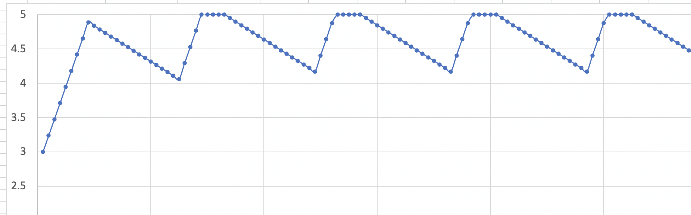

Let's walk through these parameters: 

* Average ON Current is what the trigBoard pulls on average while awake, 65-70mA can be used for this

* On Time is how long the trigBoard takes to wake and go back to sleep.  In most cases, this is <5seconds.  However this can be longer depending on WiFi strength and how long it takes to connect to whichever service is configured.  

* Super Cap is fixed at 2.5F, since this is what's built into the board.  But here as a parameter in case this is changed our or expanded on.  

* Charge current is a difficult measurement to obtain - this is the current as measured into the super capacitor.  Per testing with a single LED light fixture, ~200uA or so was measured.  On this board, if you want to measure the charge current, you'll have to cut the positive lead on the super capacitor to hook a meter in-line.  As data becomes available, updates will be made here to this page.  

* Charge time is simply how long the light is on for - in this case the light is on for 8hrs a day.  

* Wakes/Hr is how often the trigBoard wakes in an hour.  Does not need to be an integer value, meaning if the board wakes once a day like in a mailbox application, just put "=1/24"

**So how close is the calculator to the real world?**

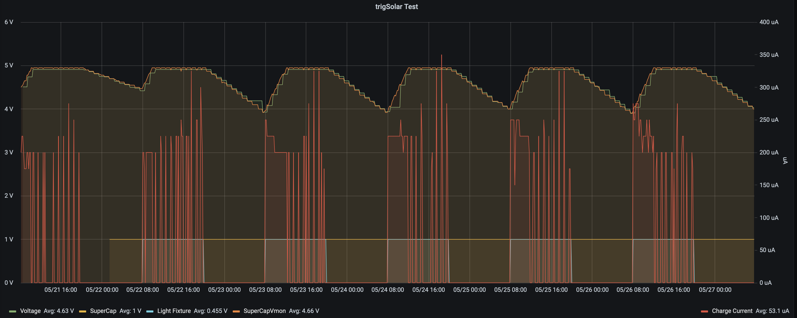

Pretty close actually!!  This setup is in a controlled location with an LED fixture controlled from Home Assistant turning on everyday for 8hrs.  Also, the trigBoard connected to the trigSolar board reports its voltage up to Home Assistant (plotted here with Grafana) once an hour.  Then in red there, you can see the charge current. This is measured with a second trigBoard taking a reading every 10minutes.  

**Settings that don't work**

The point of this calculator is to help set some expectations - for example, let's change one parameter like increasing the wakes from 1 to 3 times an hour: 

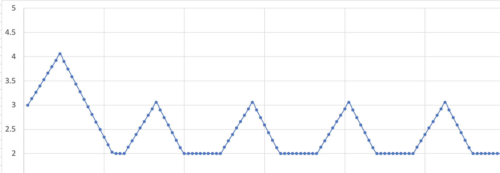

Now it can never reach a purely solar state - as soon as the voltage hits 2V there, the output is disabled or it switches over to the battery backup.  But there's trade-offs with everything, so what if you added more light? for longer period of time? or decreased the on time somehow?  These are all things to consider and experiment with.  Or maybe you're fine with this and just need a "battery extender".  That works too! 

**Super Capacitor Reserve**
============================

The built-in Super Capacitor is very high quality, has low ESR, and low leakage.  This is great for supplying power to the trigBoard with its high current spikes needed by the ESP32 module.  Only problem is that you're limited to 20-30 wakes maybe, so for an application that has plenty of light (outdoors) that would charge the 2.5F capacitor quickly, you can expand this storage with a "Super Capacitor Reserve".  An example might be an outdoor weather station that reports data every 5minutes.  During the day this is fine, but that won't last long overnight.  The solution is to add low cost/quality 100F capacitors in parallel with the existing 2.5 capacitor. In this circuit, the capacitors are only rated for 2.7V, so two are needed in series with 10k ohm balancing resistors.  Then for safety, a series 10ohm resistor in-line with to the trigSolar board. OR, 2.5V zener diodes `1N5222B-TR <https://www.digikey.com/short/mbw3887z>`_ can be used for balancing

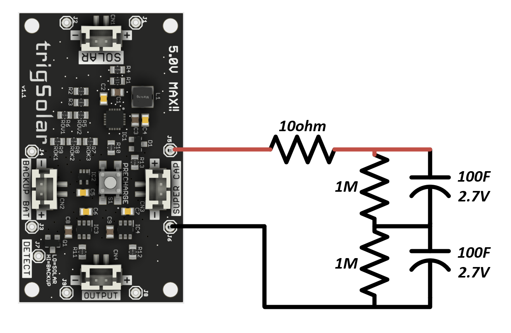

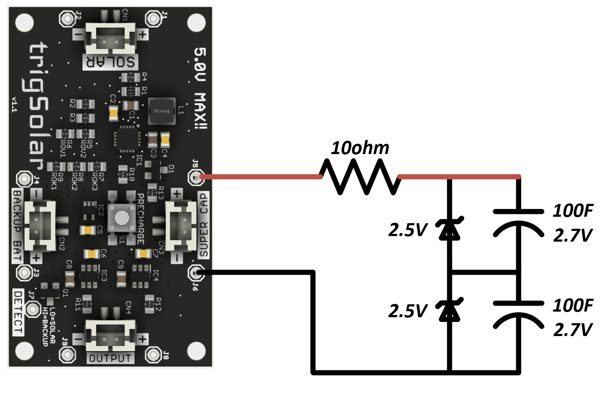

.. warning::
	These are large capacitors that can store a lot of energy even at 2.5V!  Be careful not to short the leads when they are charged.  It will burn the 10ohm resistor and/or cause other damage.

For my weather station that reports every 5minutes, see how it charges/discharges everyday and this is with the low cost small solar panel and the voltage never gets close to reaching 2V! 

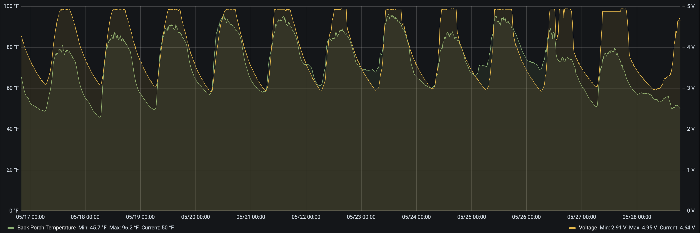

**Design**
============================

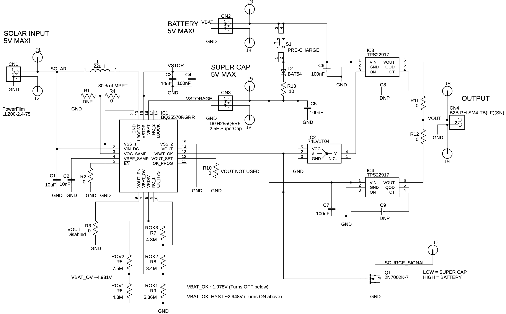

Can be downloaded here:

	:download:`trigSolarv1.1 SCH  <solarFiles/trigSolarV1.1_SCH.pdf>`

Then for reference, here is the worksheet used to set the various thresholds and parameters for the BQ2557: 

	:download:`trigSolar BQ2557 Worksheet  <solarFiles/bq25505_trigSolar.xlsx>`

A video will be made soon to walkthrough this design! 

Low Cost Outdoor Solar
-------------------------

If you can install a small panel outdoors, then this is actually very easy and inexpensive.  The efficiency of the charging and MPPT (Maximum Power Point Tracking) systems are not as critical.  Cheap boards/panels from eBay/Amazon can be used.  See the :ref:`temperature logger project <Temperature>` for details on this project.

**Materials**

`CN3791 board from eBay 6V Version <https://www.ebay.com/itm/6-9-12V-MPPT-Solar-Panel-Charger-Lithium-Battery-Charging-Regulator-Board-CN3791/143713260554?ssPageName=STRK%3AMEBIDX%3AIT&var=442762249742&_trksid=p2060353.m2749.l2649>`_

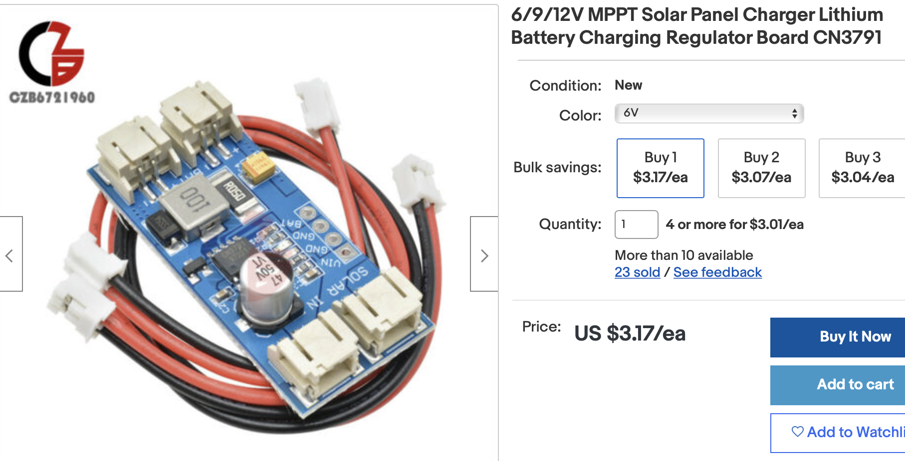

`6V 1.2W Solar Panel from eBay <https://www.ebay.com/itm/6V-1-2W-Solar-Panel-Polycrystalline-DC-Interface-Plug-Cell-Battery-Charger-WT7n/312902556468?ssPageName=STRK%3AMEBIDX%3AIT&_trksid=p2060353.m2749.l2649>`_

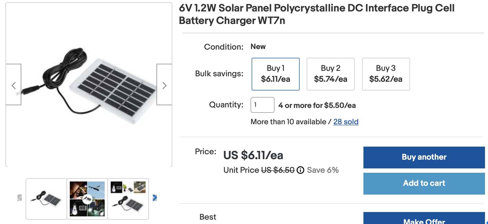

I recommend a pretty decent battery for this, just to guarantee the system can ride through the night and cloudy/rainy days.  I use a beefy `18650 style battery like this: <https://www.adafruit.com/product/1781?gclid=CjwKCAiAm-2BBhANEiwAe7eyFNRxxG8Ajqu8k1uOOnW8QCGhO4Ea60frzuJHSSbKaKbg7yeSjTitMBoCr0EQAvD_BwE>`_

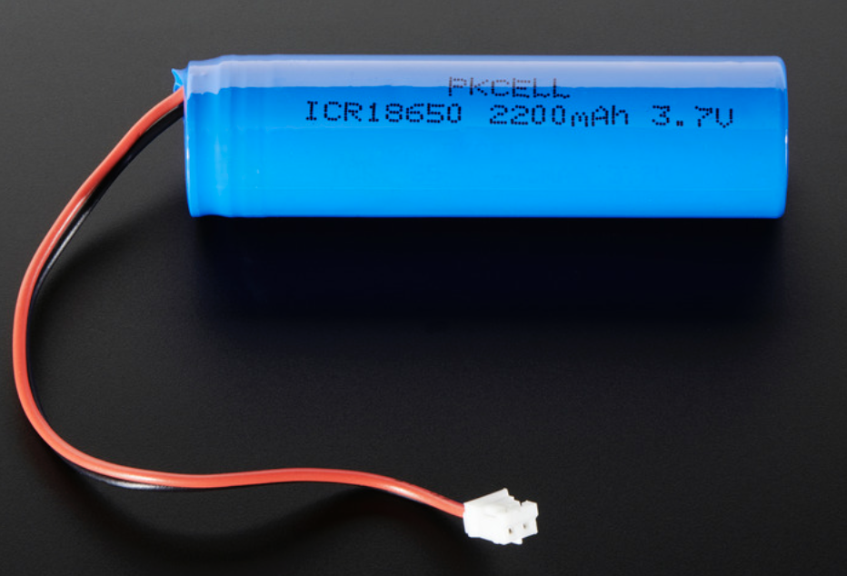

**Setup**

All materials arrived: 

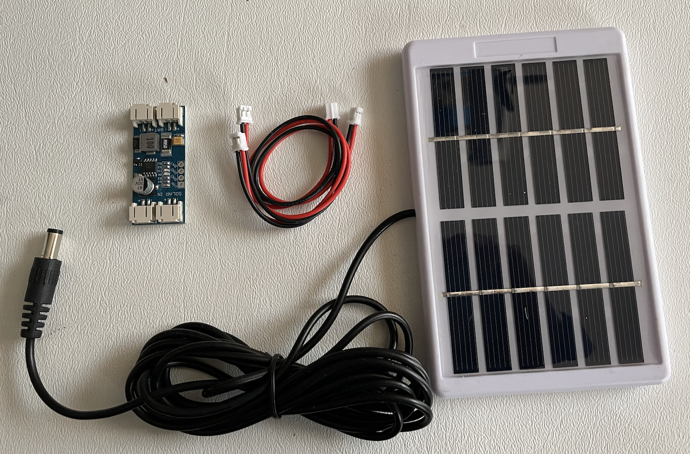

You'll notice that the solar panel has a barrel jack, so cut that off and install a JST connector as was supplied with the MPPT board:

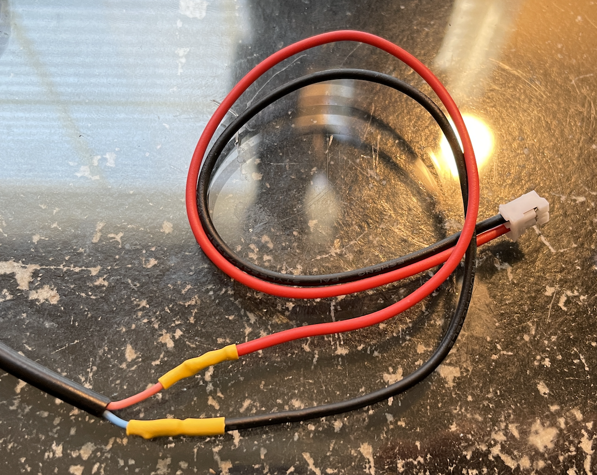

This is how it all looks wired up:

.. image:: images/soalrwithtrigboardout.png
	:align: center

**Install**

This is an example how I had tested this setup, and ran smoothly for a couple months until I switched over to the trigSolar setup.  Panel is just taped up on a gutter: 

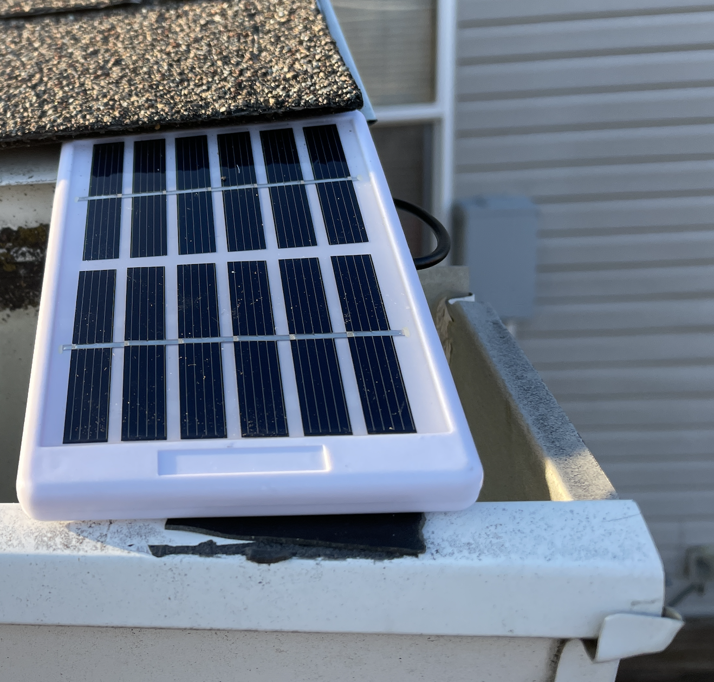

All boards just mounted in random enclosures I have - note this is under an awning to give some weather protection: 

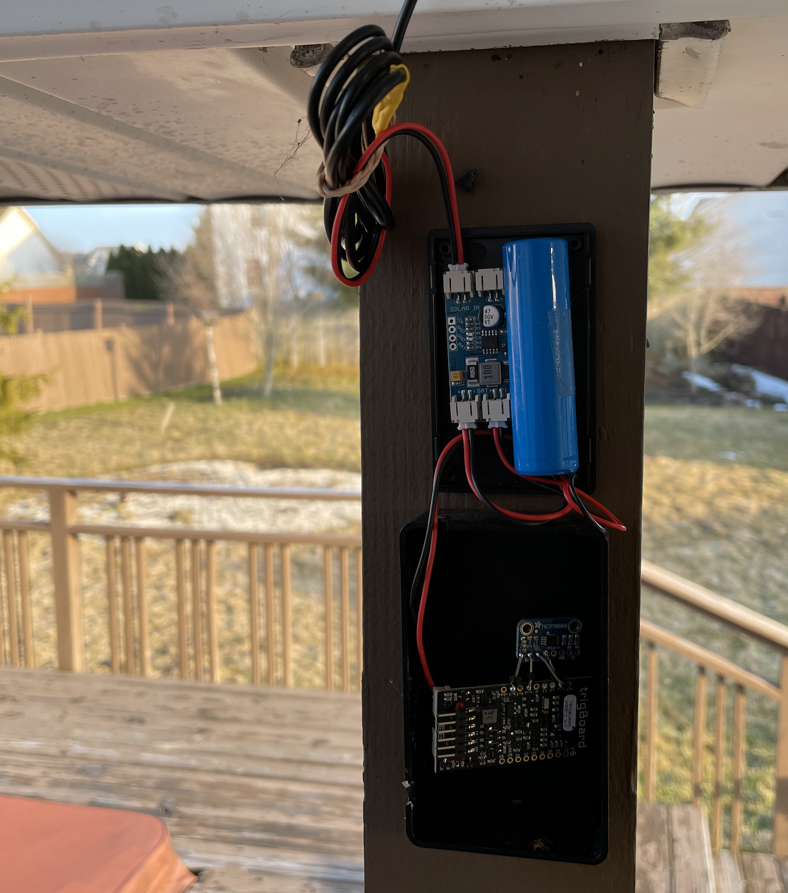

Then all buttoned up: 

.. image:: images/solarboardsallbuttonedUp.png
	:align: center

And with the :ref:`temperature logger project <Temperature>` you can see the daily charging/discharging of the battery - pretty cool!! 

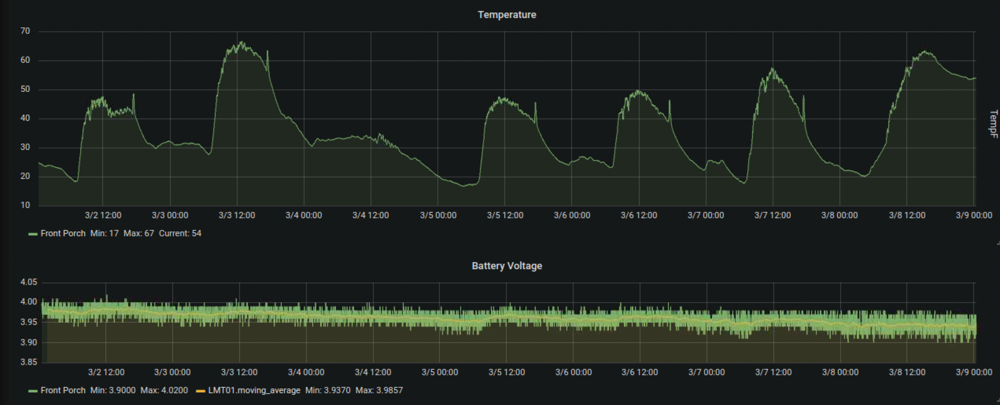

