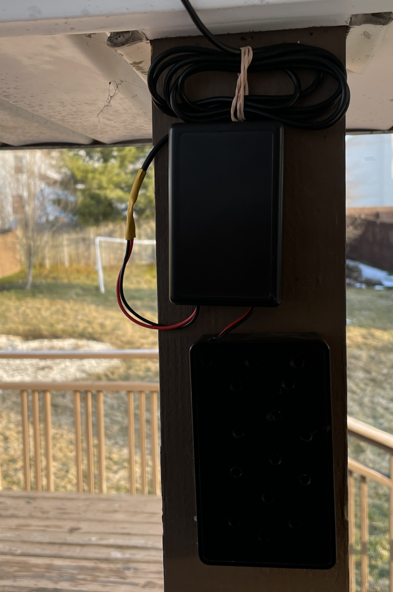

=============================
Solar Options
=============================

Outdoor Solar
--------------

If you can install a small panel outdoors, then this is actually very easy and inexpensive.  The efficiency of the charging and MPPT (Maximum Power Point Tracking) systems are not as critical.  Cheap boards/panels from eBay/Amazon can be used.  I currently have a solar system running my outdoor :ref:`temperature logger project <Temperature>` using low cost materials.  This wakes on a timer every minute, connects to WiFi, and logs temperature to a Corlysis.  After running for a few months, the 4.2V lithium cell has not ever dipped below 4V.  A wake interval of 1 minute is pretty demanding, so this is quite impressive.  

**Materials**

`CN3791 board from eBay 6V Version <https://www.ebay.com/itm/6-9-12V-MPPT-Solar-Panel-Charger-Lithium-Battery-Charging-Regulator-Board-CN3791/143713260554?ssPageName=STRK%3AMEBIDX%3AIT&var=442762249742&_trksid=p2060353.m2749.l2649>`_

.. image:: images/mpptboardebay.png
	:align: center

`6V 1.2W Solar Panel from eBay <https://www.ebay.com/itm/6V-1-2W-Solar-Panel-Polycrystalline-DC-Interface-Plug-Cell-Battery-Charger-WT7n/312902556468?ssPageName=STRK%3AMEBIDX%3AIT&_trksid=p2060353.m2749.l2649>`_

.. image:: images/solarPanelebaly.png
	:align: center

I recommend a pretty decent battery for this, just to guarantee the system can ride through the night and cloudy/rainy days.  I use a beefy `18650 style battery like this: <https://www.adafruit.com/product/1781?gclid=CjwKCAiAm-2BBhANEiwAe7eyFNRxxG8Ajqu8k1uOOnW8QCGhO4Ea60frzuJHSSbKaKbg7yeSjTitMBoCr0EQAvD_BwE>`_

**Setup**

All materials arrived: 

.. image:: images/solarOptionsMaterial.png
	:align: center

You'll notice that the solar panel has a barrel jack, so cut that off and install a JST connector as was supplied with the MPPT board:

.. image:: images/JSTsolarpanel.png
	:align: center

This is how it all looks wired up:

.. image:: images/soalrwithtrigboardout.png
	:align: center

**Install**

This is an example how I have my weather station installed, but this has been running smoothly for a couple months.  Panel is just taped up on a gutter: 

.. image:: images/solarinstalloutside.png
	:align: center

All boards just mounted in random enclosures I have - note this is under an awning to give some weather protection: 

Then all buttoned up: 

And with the :ref:`temperature logger project <Temperature>` you can see the daily charging/discharging of the battery - pretty cool!! 

Indoor Solar
--------------

Coming soon! Still under test!

