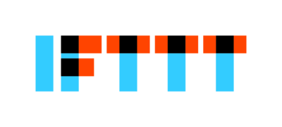

.. _Services:

=======================
Supported Services
=======================

Where the notifications are sent - the :ref:`Configurator Tool <Configurator>` is used to enable and "configure" any of these.  If the notification needs to just go straight to your smart phone, then Pushsafer or Pushover would be a good start.  For more advanced users, UDP or MQTT can be used, but these require a central gateway (rapsberry Pi or host AP)

.. _Pushsafer:

Pushsafer
---------

| `Pushsafer Service <https://www.pushsafer.com>`_ is a great service for getting push notifications to your mobile devices. There are some nice features built in, like allowing for guest devices to be added/removed. This works nicely for a vacation setup where a someone may need to temporarily monitor a property. The notifications are purchased in bulk, but very inexpensive.
	
	**Pushsafer Setup**

	#. Go to `Pushsafer.com <https://www.pushsafer.com>`_ and create an account - you'll need to download/install the app as well
	#. Copy the private key:

		.. image:: images/600px-PushSaferKeyv8.png
			:align: center

	#. Paste that in the Configurator:

		.. image:: images/pushsaferconfig.png
			:align: center

.. _Pushover:

Pushover
---------

| `Pushover Service <https://pushover.net>`_ is similar to Pushsafer in that it's a good reliable service for getting push notifications to your devices when there's an event at the trigBoards.  The app is a one time purchase per device with a monthly allowance of 7500 notifications.  That should be plenty for most applications.

	**Pushover Setup**

	#. Go to `pushover.net <https://pushover.net>`_ and create and account - you'll need to download/install the app as well

	#. You should see your private user key:

		.. image:: images/400px-Pushoveruserkey.png
			:align: center

	#. Scroll down and create a new application:

		.. image:: images/400px-PushOverCreateApp.png
			:align: center

	#. Can leave things the way they are - name whatever you want:

		.. image:: images/400px-PushoverAppcreaet.png
			:align: center

	#. Then you should see the API Token:

		.. image:: images/400px-PushoverApitok.png
			:align: center

	#. Paste both of those into the Configurator:

		.. image:: images/pushoverConfig.png
			:align: center

***********************
Sharing Notifications
***********************

If you want to share notifications with someone else, but not give them your login credentials, you can do that easily with Pushover.  Just note that if you ever plan on doing this, you should set this up ahead of time.  The user key will be different from the above steps, so you would have to change that on the trigBoard.  You would then be a subscriber to this feed yourself.

Follow the same steps as above to setup the application - in that screen, you can create a subscription code: 

		.. image:: images/pushoversubcode.png
			:align: center

Then fill out that screen and create new delivery group:

		.. image:: images/deliverygroupcreate.png
			:align: center

Then you'll notice in your application window, you have a new URL there that you can send people to subscribe to that feed:

		.. image:: images/suburlpushover.png
			:align: center

But the thing about this is that the user key that you use for the configurator needs to be for this delivery group. To find this key, you can click below that URL - in this case the "yourGroup" link there:

		.. image:: images/yourgroupurlk.png
			:align: center

There you will see the group key to be used as the user key in the trigBoard configurator - you still use the same API/Token Key from when you created the application:

		.. image:: images/groupkey.png
			:align: center

And that's all there is to it!  

.. _IFTTT:

IFTTT
---------

| This one is pretty obvious, but go check out the `IFTTT website <https://ifttt.com>`_ to see what all can be accomplished with this service. This alone can be used for the push notification, but it tends not be as fast as Pushsafer/Pushover. This is great for secondary alerts like sending emails, text messages, voice calls, home automation (lights on/off), publish to a google sheet, etc... there's a lot here

	**IFTTT Setup**

	#. Go to `IFTTT.com <https://ifttt.com>`_ which stands for "IF This Then That" and is a very powerful integration service that allows an event from the trigBoard to connect to other IoT services, like send an email, text, update a google spreadsheet, turn lights on/off, etc... It requires a maker key in order to work, so first sign up or sign in using whatever option you want to use. I use google to login.

	#. Search for webhooks, then click services:

		.. image:: images/400px-Iftttwebhooks.png
			:align: center

	#. Just click on the webhooks service, click connect, and should be good to go. You should then see a "documentation" button:

		.. image:: images/400px-Iftttdocu.png
			:align: center

	#. Here you will see the maker key:

		.. image:: images/400px-Iftttkey.png
			:align: center

	#. Then it's pretty easy to setup the IF this then That recipe. Just use the web hook for the IF event, where the Event Name is what is given as the trigBoard name in the configurator (no spaces), then the Value 1 is the name, Value 2 is the message.

	#. Paste that maker key into the configurator:

		.. image:: images/ifttconfig.png
			:align: center	

.. _UDP:

UDP
---------

More for the advanced user, but if you're looking to take this to the next level, UDP messaging allows for a tight and fast network for getting the notifications out. Basically, a central gateway would be setup acting as a UDP server, where all of the trigBoards communicate back to. This is great for building a secure standalone trigBoard network that's battery backed and could also allow for a cellular connection.

.. _MQTT:

MQTT
---------

Similar to UDP, but if you're using the raspberry pi or something to run your home automation system, and it's all based on MQTT messaging, then this will work great for that. This was added in at the request of support for Home Assistant (not tested though)
