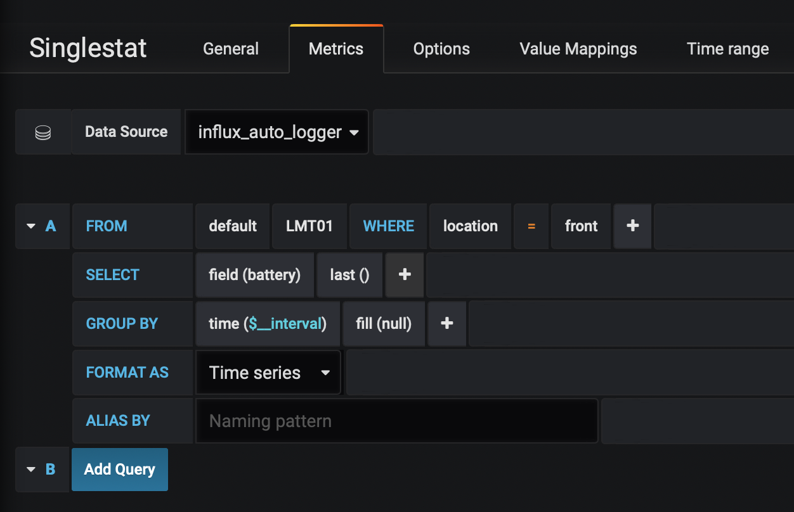

=========================================
Temperature Logging to Grafana
=========================================

.. image:: images/grafanatemp.png
	:align: center

This project shows off what you can do with the low power real time clock on the trigBoard - simply set the interval wake time and the trigBoard will automatically wake and send the temperature reading to the cloud.  In this example, `Corlysis <https://corlysis.com>`_ is used for as the cloud provider.  This could just as well be hosted on a local setup using a raspberry pi, but with everything hosted in the cloud, it is very easy to view the data from anywhere and share with others.

The wiring is simple - just need an `MCP9808 Breakout Board from Adafruit <https://www.adafruit.com/product/1782>`_ which is a very accurate, fast, and reliable temperature sensor.

.. image:: images/MCP9808wiringwithtrigboard.png
	:align: center

.. image:: images/MCP9808Installed.png
	:align: center

If you have a trigBoard running the stock base firmware, you could simply OTA this code over, or compile the code yourself, but first make sure you can compile the base firmware.  See the firmware section for more information.  

Just note the only new library needed is the Adafruit MCP9808 lib - you can add this from Arduino Sketch>>Include Library>>ManageLibraries menu

`MCP9808 Code is Here <https://github.com/krdarrah/trigBoard_MCP9808>`_

**Corlysis**
-------------

This code was designed to work with `Corlysis <https://corlysis.com>`_, so first make sure you go over there and setup an account, then create a database:

Name this whatever you want, but we will need it later when setting up the trigBoard.  Next, click the API Keys menu: 

.. image:: images/corlysisApi.png
	:align: center

Just copy your Key there - we will need this later as well for setting up the trigBoard.  

**Setup**
-------------

What's really cool about this code is that it re-uses other fields in the trigBoard configurator to set this up to work with Corlysis, so no need to hard code things. Before setting up, you need to decide a few things first: 

* The Database Name is what you already created in Corlysis

* Measurement name is like the name of all these devices. So in my case, I call this LMT01.  I'll have a whole bunch named LMT01 as this type of sensor.  

* Location Name is what I use to locate the sensors, so Front porch, Garage, Inside, etc... We'll also use this to parse out the data, so should be unique.  

* C or F is obvious, put in either C or F to set the conversion

* API Key is straight from Corlysis, just copy and paste that over.  

+------------------------------------+---------------------------+
|Configurator                        |Corlysis                   |
+====================================+===========================+
|trigBoard Name                      |Database Name from Corlysis|
+------------------------------------+---------------------------+
|Message when Contact Opens          |Measurement Name           |
+------------------------------------+---------------------------+
|Message when Contact Closes         |Location Name              |
+------------------------------------+---------------------------+
|Message when Wake Button Pressed    |C or F                     | 
+------------------------------------+---------------------------+
|Timer Message for Contact still Open|API Key                    |
+------------------------------------+---------------------------+

So then when you launch the configurator, you setup your WiFi credentials, the interval time in the timer settings, then the Corlysis parameters:

**Grafana**
-------------

Ok, so here's where things get cool - Corlysis is hosting both the influxDB where the data is stored and also Grafana where the data can be plotted.  One you have a trigBoard sending data, you can click on he grafana menu. Then create a new dashboard in there, new panel as well, and select graph: 

.. image:: images/grafdash.png
	:align: center

.. image:: images/grafgraph.png
	:align: center

Then click the drop down to edit the panel:

.. image:: images/grafpanedit.png
	:align: center

make sure you're on the metrics tab do the following: 

* Data Source - click in there and select the database you created where the trigBoard is sending data

* FROM default - then you select the measurement name or type it in, mine is LMT01

* WHERE - this is how we filter by location, so you'll have to type in location, then = to whatever you want to show. Mine is "front"

* SELECT - we're actually sending multiple pieces of data for this measurement, but we're plotting temperature here, so select temperature between the field(..)

* Then after that remove the mean() by clicking on it and then add distinct() which is in the Aggregations menu.  

You should now see data!!  Note that you can also plot battery voltage the same way, but select battery instead of temperature.

You can also create these cool gauges, by making a new panel for single stat - just choose last for the Selector:

And in options, select current for the data and you can tweak other things:

If this only updates every once and a while, I like to make sure it at least spans out a year looking for the latest:

.. image:: images/singleTimeRange.png
	:align: center

