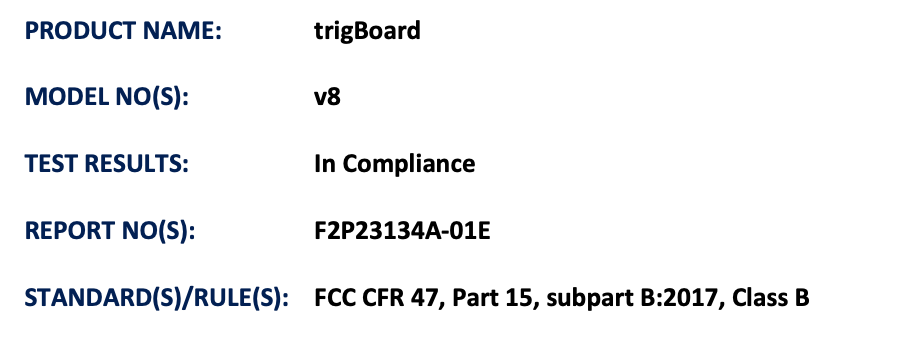
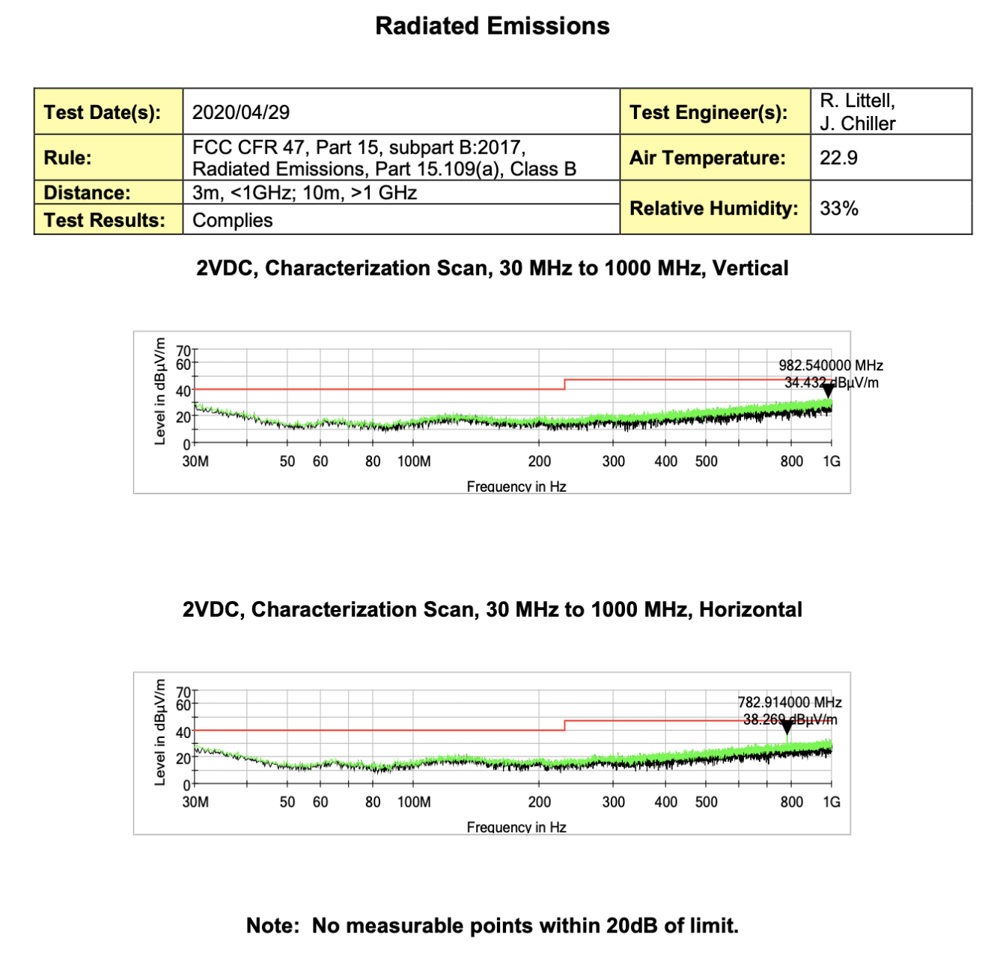
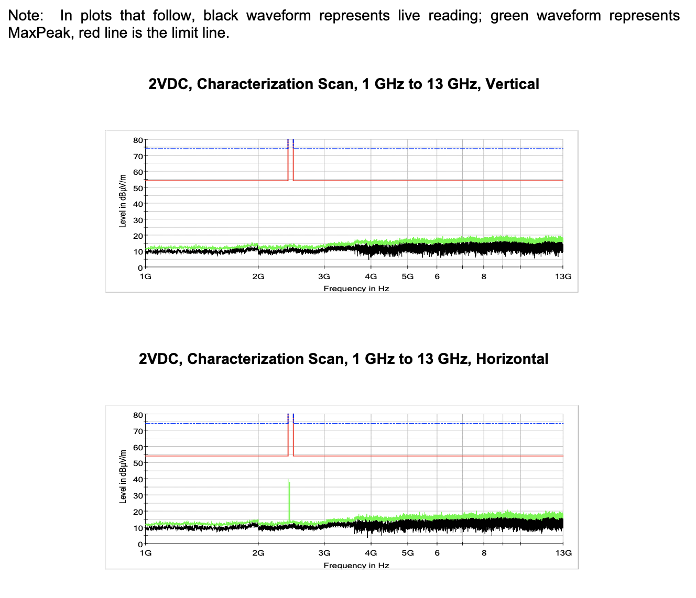
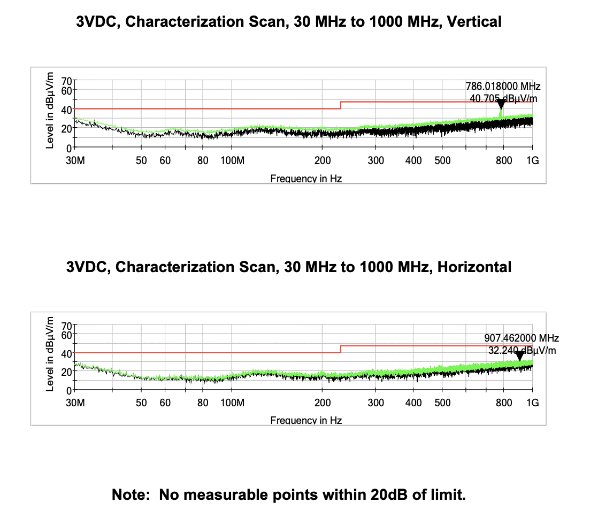
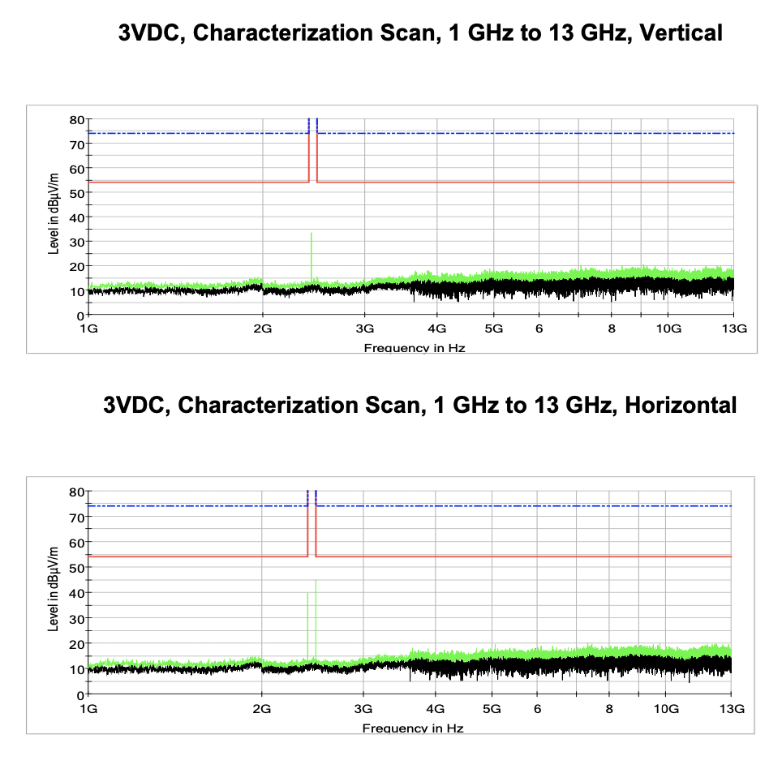

===========================
Testing/Factory Programming
===========================

Factory Programming and Functional Checkout
-------------------------------------------

| Every single board that ships endures a full suite of tests and is factory programmed with the base firmware:
| **1** - power is applied to ensure no short circuits exist.  This provides a very basic checkout that at least there's no catasrophic problems with the board. 
| **2** - the base firmware is loaded via the 6 pin header using a USB-Serial converter (FT230X based). This verifies many things, including the power supplies work, the auto-rest programming interface works, and the ESP32 is alive and well. 
| **3** - the base firmware defaults to send UDP messages, so the wireless mechanisms can be tested right as well. A UDP reciever board is used to check that messages from the board under test is sending what it's supposed to.
|	**Timer Wake Message is sent** by default in the test code, timer wakes frequently
|	**Contact Opened Message Using magnetic Sensor** both open/closed set in test code
|	**Contact Closed Message Using magnetic Sensor**
|	**Wake Buttton Message** press and hold wake button
|	Only if all of these messages are received, will the trigBoard pass the test.  This verifies the wireless works, the timer works, the wake inputs work, the button works, and the battery voltage measurement works
| **4** - then the board is tested with the configurator, so the wake button is held in until the LED flashes, connects to the configurator over bluetooth and several settings are modified, since these were only set for factory testing:
|	TIMER UNITS = MINUTES>>> SAVE
|	TIMER WAKE TIME = 60>>> SAVE
|	TIMER CHECKS FOR LO-BATTERY and = NOTHING >>> SAVE
|	Udp enabled = UNCHECK >>> SAVE
| **5** - The battery voltage measurement is calibrated and an offset is entered into the configurator
| **6** - finally, and maybe the most important test is to disconnect from the bluetooth connection, and check the sleep current is in the single digit uA

FCC Testing
-------------------------------------------

The trigBoard contains an FCC pre-certified module - (ESP32-WROOM-32D) That certification can be found `here <https://www.espressif.com/sites/default/files/esp32-wroom-32d_fcc_wi-fi_bt4.0_certificate.pdf>`_ and any of the other certifications can be found `here <https://www.espressif.com/en/support/documents/certificates>`_

The board was still tested for non-intentional radiation and passed with no issues - the board was tested with both a 3V and 2V input:

See :ref:`contact page <Contact>` to request more information

