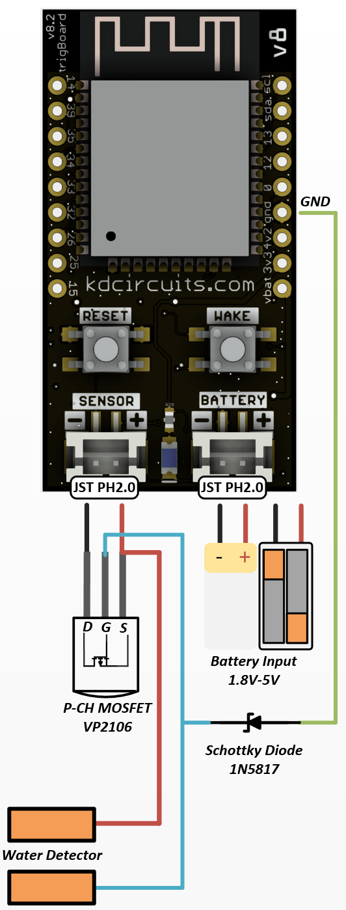
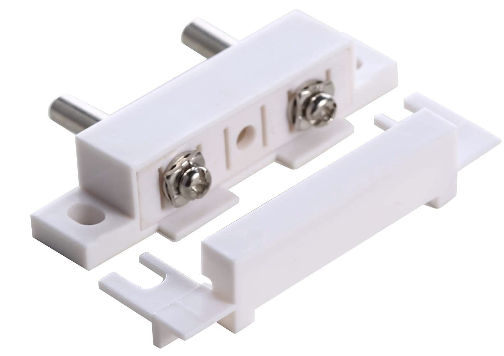

=======================
Water Leak Detector
=======================

This is the ultimate low power water detector circuit.  Works for detecting rain, floods, etc... and it is sensitive enough to report status of the contact, like if there is still water present or not.  

VP2106 MOSFET From Digikey `VP2106N3-G-ND <https://www.digikey.com/en/products/detail/VP2106N3-G/VP2106N3-G-ND/4902414?itemSeq=340798425>`_

1N5817 Schottky Diode from Digikey `1N5817DICT-ND <https://www.digikey.com/en/products/detail/1N5817-T/1N5817DICT-ND/190530?itemSeq=340798546>`_

I've made my own sensors in the past, but these are highly recommended `from Amazon <https://www.amazon.com/gp/product/B014SACDSO/ref=ppx_yo_dt_b_asin_title_o07_s00?ie=UTF8&th=1>`_

This circuit is actually inverted, so set your detection in the configurator on the "opening" of the contact:

