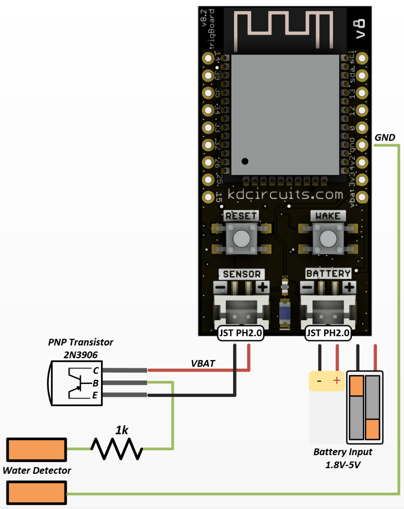

=======================
Water Leak Detector
=======================

That's the circuit to build a simple water detector or flood alarm.  Just build this circuit, set the configurator to monitor only when the contact closes